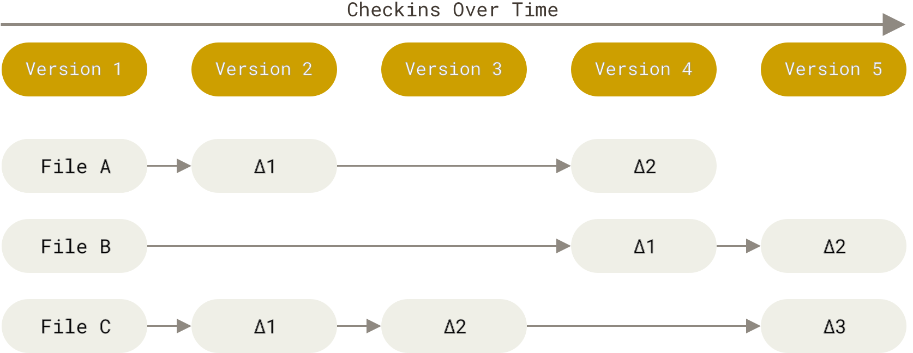
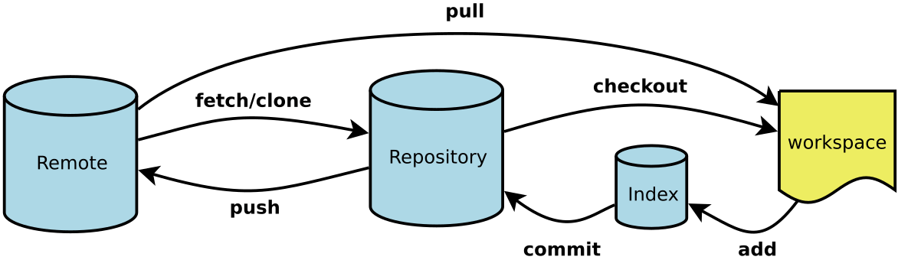

+++
title = 'Git'
date = '2026-02-05T08:50:00+08:00'
draft = false

description = "Git 版本控制系统核心概念与常用命令速查"
categories = ["Tools"]
series = []
authors = []

toc = true
featuredImage = ""
externalLink = ""
canonicalUrl = ""
disableComments = false
+++

> Git 是一种分布式版本控制系统，其核心概念在于跟踪文件变更、记录完整历史版本，并支持多人在不同分支上并行开发。它通过哈希值确保数据完整性，使团队能够高效协作、灵活合并代码，并随时回溯到任意历史状态。作为现代软件开发的基石，Git 不仅是代码托管平台（如 GitHub）的基础，也广泛应用于文档管理和配置控制，极大提升了项目迭代的可追溯性与可靠性。—— DeepSeek

## 简介

Git 和其它版本控制系统（包括 Subversion 和近似工具）的主要差别在于 Git 对待数据的方式。 从概念上来说，其它大部分系统以文件变更列表的方式存储信息，这类系统（CVS、Subversion、Perforce 等等） 将它们存储的信息看作是一组基本文件和每个文件随时间逐步累积的差异 （它们通常称作 基于差异（delta-based） 的版本控制）。



_存储每个文件与初始版本的差异_

Git 不按照以上方式对待或保存数据。反之，Git 更像是把数据看作是对小型文件系统的一系列快照。 在 Git 中，每当你提交更新或保存项目状态时，它基本上就会对当时的全部文件创建一个快照并保存这个快照的索引。 为了效率，如果文件没有修改，Git 不再重新存储该文件，而是只保留一个链接指向之前存储的文件。 Git 对待数据更像是一个 快照流。


_存储项目随时间改变的快照_

- Workspace: 工作区
- Index / Stage: 暂存区
- Repository: 仓库区 ( 本地版本库 )
- Remote: 远程仓库 ( 远程仓库 / 远程版本库 )



_Git 工作流程_

## 开始使用

创建新仓库：

```bash
git init
```

克隆现有仓库：

```bash
git clone <url>
```

## 准备提交

添加未跟踪文件或未暂存的更改：

```bash
git add <file>
```

添加所有未跟踪文件和未暂存的更改：

```bash
git add .
```

选择要暂存的文件部分：

```bash
git add -p
```

移动文件：

```bash
git mv <old> <new>
```

删除文件：

```bash
git rm <file>
```

让 Git 忘记某个文件但不删除它：

```bash
git rm --cached <file>
```

取消暂存一个文件：

```bash
git reset <file>
```

取消暂存所有内容：

```bash
git reset
```

检查你添加的内容：

```bash
git status
```

## 创建提交

创建提交（并打开文本编辑器编写消息）：

```bash
git commit
```

创建提交：

```bash
git commit -m 'message'
```

提交所有未暂存的更改：

```bash
git commit -am 'message'
```

## 在分支间移动

切换分支：

```bash
git switch <name>

或

git checkout <name>
```

创建分支：

```bash
git switch -c <name>

或

git checkout -b <name>
```

列出分支：

```bash
git branch
```

按最近提交时间列出分支：

```bash
git branch --sort=-committerdate
```

删除分支：

```bash
git branch -d <name>
```

强制删除分支：

```bash
git branch -D <name>
```

## 比较已暂存/未暂存的更改

比较所有已暂存和未暂存的更改：

```bash
git diff HEAD
```

仅比较已暂存的更改：

```bash
git diff --staged
```

仅比较未暂存的更改：

```bash
git diff
```

## 比较提交

显示提交与其父提交之间的差异：

```bash
git show <commit>
```

比较两个提交：

```bash
git diff <commit> <commit>
```

比较自某个提交以来一个文件的变化：

```bash
git diff <commit> <file>
```

显示差异摘要：

```bash
git diff <commit> --stat

git show <commit> --stat
```

## 引用提交的方式

```text
每次我们说 `<commit>` 时，你可以使用以下任何一种：
☆ a branch          main
☆ a tag             v0.1
☆ a commit ID       3e887ab
☆ a remote branch   origin/main
☆ current commit    HEAD
☆ 3 commits ago     HEAD^^^ 或 HEAD~3
```

## 丢弃你的更改

删除一个文件的未暂存更改：

```bash
git restore <file>

或

git checkout <file>
```

删除一个文件的所有已暂存和未暂存更改：

```bash
git restore --staged --worktree <file>

或

git checkout HEAD <file>
```

删除所有已暂存和未暂存的更改：

```bash
git reset --hard
```

删除未跟踪的文件：

```bash
git clean
```

“储存”所有已暂存和未暂存的更改：

```bash
git stash
```

## 编辑历史

"重置"最近的提交（保持工作目录不变）：

```bash
git reset HEAD^
```

将最后 5 个提交压缩为一个：

```bash
git rebase -i HEAD~6
```

_然后将任何你想修正到上一个提交的提交的 "pick" 改为 "fixup"_

恢复失败的变基：

```bash
git reflog BRANCHNAME
```

然后在 reflog 中手动找到正确的提交 ID，然后运行：

```bash
git reset --hard <commit>
```

更改提交消息（或添加你忘记的文件）：

```bash
git commit --amend
```

## 查看历史记录

查看分支的历史：

```bash
git log main
git log --graph main
git log --oneline
```

显示修改某个文件的所有提交：

```bash
git log <file>
```

显示修改某个文件的所有提交，包括重命名之前：

```bash
git log --follow <file>
```

查找添加或删除某些文本的所有提交：

```bash
git log -G banana
```

显示谁最后更改了文件的每一行：

```bash
git blame <file>
```

## 合并分叉的分支

使用变基：

```bash
git switch banana
git rebase main
```

之前：


之后：


使用合并：

```bash
git switch main
git merge banana
```

之前：


之后：


使用压缩合并：

```bash
git switch main
git merge --squash banana
git commit
```

之前：


之后：


使分支与另一个分支保持同步（也称为"快进合并"）：

```bash
git switch main
git merge banana
```

之前：


之后：


挑选提交到当前分支：

```bash
git cherry-pick <commit>
```

之前：


之后：


## 恢复旧文件

从另一个提交获取文件的版本：

```bash
git checkout <commit> <file>

或

git restore <file> --source <commit>
```

## 添加远程仓库

```bash
git remote add <name> <url>
```

## 推送你的更改

将 `main` 分支推送到远程 `origin`：

```bash
git push origin main
```

将当前分支推送到其远程"跟踪分支"：

```bash
git push
```

推送你从未推送过的分支：

```bash
git push -u origin <name>
```

强制推送：

```bash
git push --force-with-lease
```

推送标签：

```bash
git push --tags
```

## 拉取更改

获取更改（但不更改你的任何本地分支）：

```bash
git fetch origin main
```

获取更改然后变基你的当前分支：

```bash
git pull --rebase
```

获取更改然后将其合并到你的当前分支：

```bash
git pull origin main

或

git pull
```

## 配置 Git

设置配置选项：

```bash
git config user.name 'Your Name'
```

全局设置选项：

```bash
git config --global ...
```

添加别名：

```bash
git config alias.st status
```

查看所有可能的配置选项：

```bash
man git-config
```

## 重要文件

本地 git 配置：

```bash
.git/config
```

全局 git 配置：

```bash
~/.gitconfig
```

要忽略的文件列表：

```bash
.gitignore
```

## Commit 规范

| 类型         | 说明                         | 示例                                          |
| :----------- | :--------------------------- | :-------------------------------------------- |
| **feat**     | 新增功能 (feature)           | `feat(auth): 添加微信登录功能`                |
| **fix**      | 修复 bug                     | `fix(payment): 修复支付回调重复通知`          |
| **docs**     | 文档变更                     | `docs(api): 更新用户登录接口文档`             |
| **style**    | 代码格式调整（不影响功能）   | `style(ui): 调整按钮组件的CSS格式`            |
| **refactor** | 代码重构（非新增功能或修复） | `refactor(order): 使用策略模式重构优惠券计算` |
| **test**     | 增加或修改测试               | `test(user): 添加用户注册的单元测试`          |
| **chore**    | 构建过程或辅助工具的变动     | `chore(deps): 升级webpack到v5.0.0`            |
| **perf**     | 性能优化                     | `perf(image): 使用懒加载优化首屏图片`         |
| **revert**   | 回滚到之前的版本             | `revert: 回滚用户权限更新代码`                |
| **build**    | 构建系统或外部依赖变更       | `build(npm): 新增对Node 18的支持`             |
| **ci**       | CI 配置和脚本变更            | `ci(github): 添加自动化单元测试流水线`        |

## 参考

[1] [https://git-scm.com/book/zh/v2](https://git-scm.com/book/zh/v2)

[2] [https://git-scm.com/cheat-sheet#getting-started](https://git-scm.com/cheat-sheet#getting-started)
