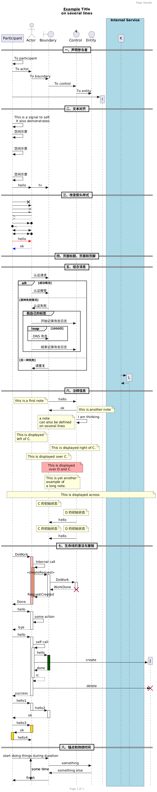

+++
title = 'PlantUML'
date = '2026-03-15T11:30:00+08:00'
draft = false

description = "PlantUML 时序图语法参考：参与者、箭头样式、分组、注释与生命线"
categories = ["Tools"]
series = []
authors = []

toc = true
featuredImage = ""
externalLink = ""
canonicalUrl = ""
disableComments = false
+++

## Sequence Diagram（时序图）



```txt
@startuml 示例

== 一、声明参与者 ==

' participant（参与者）
' actor（角色）
' boundary（边界）
' control（控制）
' entity（实体）
' database（数据库）
' collections（集合）
' queue（队列）

participant Participant as A
actor       Actor       as B
boundary    Boundary    as C
control     Control     as D
entity      Entity      as E
' database    Database    as F
' collections Collections as G
' queue       Queue       as H

A -> A : To participant
A -> B : To actor
B -> C : To boundary
C -> D : To control
D -> E : To entity

' 可以把关键字 create 放在第一次接收到消息之前，以强调本次消息实际上是在创建新的对象

create I
A -> I

== 二、文本对齐 ==

' 箭头上的文本对齐可以用 skinparam sequenceMessageAlign，后接参数 left/right/center

skinparam sequenceMessageAlign center

' 让响应信息显示在箭头下面

skinparam responseMessageBelowArrow true

' 消息文字可以用 \n 来换行

A -> A : This is a signal to self. \nIt also demonstrates

' 您可以使用 sequenceMessageSpan 命令来让消息文本跨越涉及的参与者范围

!pragma teoz true
!pragma sequenceMessageSpan true

' 可以使用 ||| 来增加空间
' 可以使用数字指定增加的像素数量

A -> A : 空间示意
|||
A -> A : 空间示意
||60||
A -> A : 空间示意

' 可以使用 & teoz 命令显示并行信息

!pragma teoz true

A -> B : hello
& B -> C : hi

== 三、改变箭头样式 ==

' 添加最后的 x 表示丢失的信息
' 使用 \ 或 / 而不是 < 或 > 只拥有箭头的底部或顶部部分
' 重复箭头（例如 >> 或 // ），拥有一个薄的图纸
' 使用 -- 而不是 - 拥有一个点状箭头
' 在箭头头添加最后的 "o"
' 使用双向的箭头 <->

A ->x B
A -> B
A ->> B
A -\ B
A \\- B
A //-- B
A ->o B
A o\\-- B
A <-> B
A <->o B

' 修改箭头颜色

A -[#red]> B : hello
B -[#0000FF]-> A : ok

== 四、页面标题、页眉和页脚 ==

' title 关键字用于为页面添加标题
' 以下效果等同：title __Example__ Title \non several lines

title
__Example__ Title
on several lines
end title

' 页面可以使用 header 和 footer 显示页眉和页脚

header Page Header
footer Page %page% of %lastpage%

' 使用 hide footbox 关键字移除脚注

hide footbox

' 为了符合严格 UML 的标准（线头的形状必须是三角形，而不能是箭头形），你可以使用
skinparam style strictuml

== 五、组合消息 ==

' alt/else
' opt
' loop
' par
' break
' critical
' group，后面紧跟着消息内容
'
' 关键词 end 用来结束分组
' 分组可以嵌套使用

B -> C : 认证请求
alt 成功情况
    B -> C : 认证接受
else 某种失败情况
    C -> B : 认证失败
    group 我自己的标签
    B -> D : 开始记录攻击日志
        loop 1000次
            B -> C : DNS 攻击
        end
    B -> D : 结束记录攻击日志
    end
else 另一种失败
   C -> B : 请重复
end

' 可以使用 box 和 end box 画一个盒子将参与者包裹起来
' 可以在 box 关键字之后添加标题或者背景颜色

box "Internal Service" #LightBlue
create K
create L
K -> L
L --> K
end box

== 六、注释信息 ==

' 可以使用 note left 或 note right 关键字在信息后面加上注释
' 可以使用 end note 关键字有一个多行注释
' 可以使用 note left of，note right of 或 note over 在节点（participant）的相对位置放置注释
' 可以使用 note across 在所有参与者之间添加备注

C -> D : hello
note left : this is a first note
D -> C : ok
note right : this is another note
D -> D : I am thinking
note left
a note
can also be defined
on several lines
end note
note left of C
This is displayed
left of C.
end note
note right of C : This is displayed right of C.
note over C : This is displayed over C.
note over C, D #FFAAAA : This is displayed\n over D and C.
note over D, C
This is yet another
example of
a long note.
end note
note across : This is displayed across

' 可以使用 / 可以在同一级对齐多个备注

note over C : C 的初始状态
note over D : D 的初始状态
D -> C : hello

note over C : C 的初始状态
/ note over D : D 的初始状态
D -> C : hello

== 七、生命线的激活与撤销 ==

' 关键字 activate 和 deactivate 用来表示参与者的生命活动
' destroy 表示一个参与者的生命线的终结
' 可以使用嵌套的生命线，并且给生命线添加颜色

A -> B : DoWork
activate B #FFBBBB
B -> B : Internal call
activate B #DarkSalmon
B -> C : << createRequest >>
activate C
C -> D : DoWork
activate D
D --> C : WorkDone
destroy D
C --> B : RequestCreated
deactivate C
deactivate B
B -> A : Done
deactivate B

' 新命令 return 可以用于生成一个带有可选文本标签的返回信息
' 返回的点是导致最近一次激活生命线的点
' 语法是简单的返回标签，其中标签（如果提供）可以是传统信息中可以接受的任何字符串

A -> B : hello
activate B
B -> B : some action
return bye

' 在指定目标参与者后，可以立即使用以下快捷语法：
' ++ 激活目标（可选择在后面加上 #color）
' -- 撤销激活源
' ** 创建目标实例
' !! 摧毁目标实例

A -> B ++ : hello
B -> B ++ : self call
B -> C ++ #005500 : hello
B -> J ** : create
return done
return rc
B -> J !! : delete
return success

' 可以在一行上同时激活和撤销

A -> B ++ : hello1
B -> C --++ : hello2
C --> A -- : ok

A -> B ++ #gold : hello3
B -> A --++ #gold : ok
A -> B -- : hello4

== 八、锚点和持续时间 ==

' 使用teoz在图表中添加锚点，从而指定持续时间

!pragma teoz true

{start} A -> C : start doing things during duration
C -> E : something
E -> C : something else
{end} C -> A : finish

{start} <-> {end} : some time

@enduml
```

## 参考

[1] [https://plantuml.com](https://plantuml.com)
