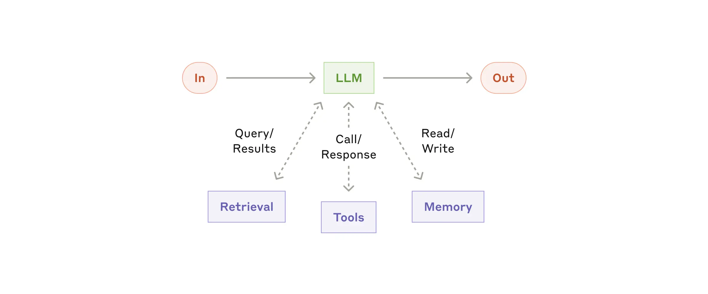
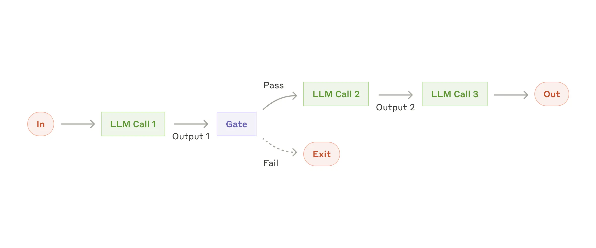
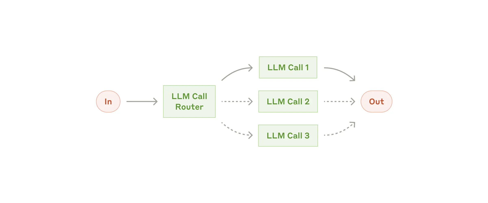
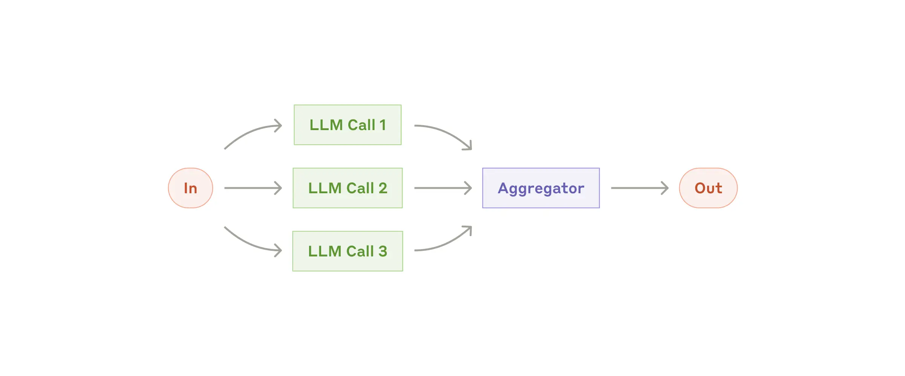
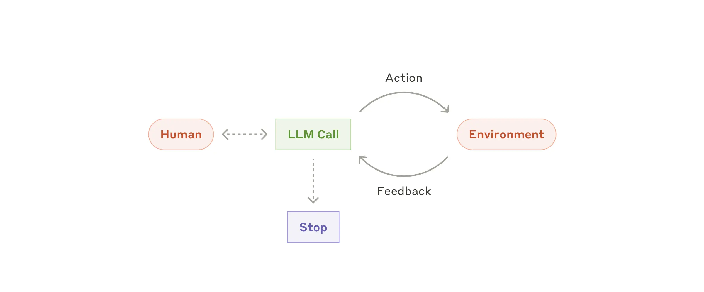
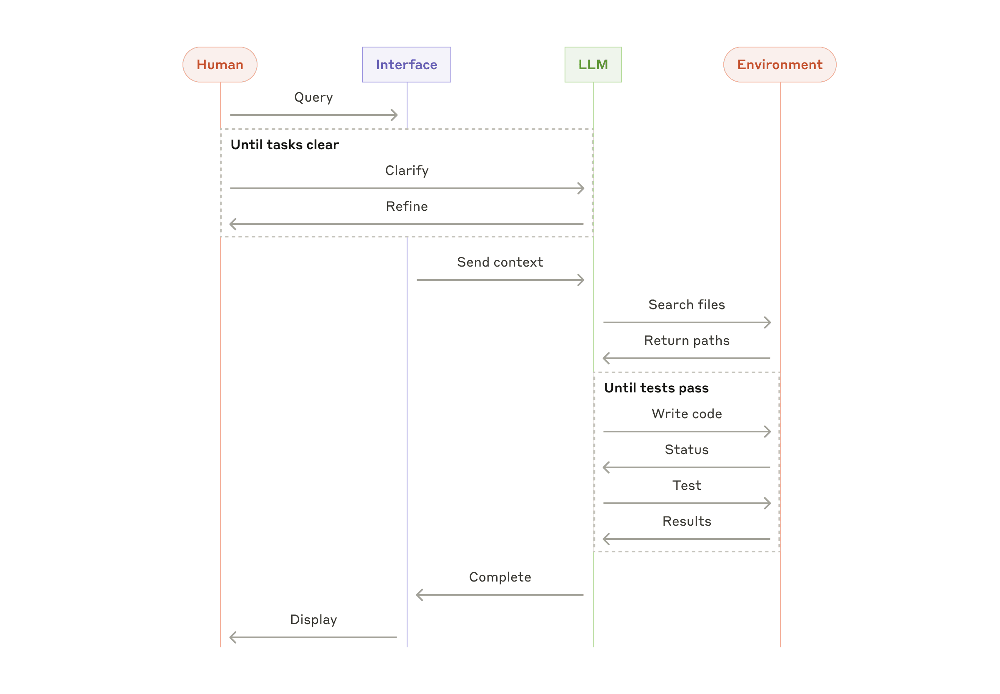

+++
title = '构建高效的 AI Agent'
date = '2024-12-19T00:00:00+08:00'

description = "了解 Anthropic 如何构建可靠的 AI Agent。本文涵盖我们在 Agent 能力、安全性考量以及构建可信 AI 的技术框架方面的研究。"
categories = ["Agent"]
series = []
authors = ["Erik S", "Barry Zhang"]

toc = true
externalLink = ""
canonicalUrl = "https://www.anthropic.com/engineering/building-effective-agents"
disableComments = false
+++

 我们与数十个团队合作，在各行各业构建 LLM Agent。一个始终如一的发现是，最成功的落地实践往往采用简单、可组合的模式，而非复杂的框架。 

*说明：本文中描述的大部分工具生态自 2024 年 12 月以来已发生变化。关于我们当前的方法，请参阅[**我们如何构建 Claude Managed Agents**](https://www.anthropic.com/engineering/managed-agents)* *以及 [**Managed Agents 文档**](https://platform.claude.com/docs/en/managed-agents/overview)。*

在过去一年里，我们与数十个团队合作，构建覆盖各行业的大语言模型（LLM）Agent。我们一致发现，最成功的实现并非使用复杂的框架或专用库，而是采用简单、可组合的模式构建而成。

在这篇文章中，我们将分享从客户合作和自身 Agent 构建经验中学到的心得，并为开发者提供构建高效 Agent 的实用建议。

## 什么是 Agent？

"Agent"有多种定义方式。有些客户将 Agent 定义为完全自主的系统，能够在较长时间内独立运行，使用各种工具完成复杂任务。另一些客户则用这个术语描述遵循预定义工作流的更具规范性的实现。在 Anthropic，我们将所有这些变体统称为 **agentic 系统**，但在架构上对**工作流**和 **Agent** 做了重要区分：

- **工作流**是通过预定义代码路径来编排 LLM 和工具的系统。
- **Agent**则是 LLM 动态控制自身流程和工具使用的系统，由模型自主决定如何完成任务。

下面我们将详细探讨这两种 agentic 系统。在附录一（"实践中的 Agent"）中，我们会介绍客户在哪些领域发现使用这类系统特别有价值。

## 何时（以及何时不）使用 Agent

在使用 LLM 构建应用时，我们建议寻找最简单的可行方案，仅在必要时才增加复杂性。这意味着有时根本不需要构建 agentic 系统。Agentic 系统通常以更高的延迟和成本换取更好的任务表现，你需要权衡这种取舍是否合理。

当确实需要更高复杂度时，工作流为定义明确的任务提供了可预测性和一致性，而 Agent 则更适合需要灵活性和模型驱动决策的大规模场景。然而，对于许多应用来说，通过检索和上下文示例来优化单次 LLM 调用通常已经足够。

## 何时以及如何使用框架

有许多框架可以让构建 agentic 系统变得更容易，包括：

- [Claude Agent SDK](https://platform.claude.com/docs/en/agent-sdk/overview)；
- [AWS 的 Strands Agents SDK](https://strandsagents.com/latest/)；
- [Rivet](https://rivet.ironcladapp.com/)，一个拖拽式 GUI LLM 工作流构建器；以及
- [Vellum](https://www.vellum.ai/)，另一个用于构建和测试复杂工作流的 GUI 工具。

这些框架通过简化调用 LLM、定义和解析工具、串联调用等标准底层任务，让入门变得容易。然而，它们往往会引入额外的抽象层，可能掩盖底层的 prompt 和响应，使调试更加困难。它们还可能让人倾向于在不必要的情况下增加复杂性。

我们建议开发者从直接使用 LLM API 开始：许多模式用几行代码就能实现。如果你确实使用框架，请确保理解底层代码。对框架底层机制的错误假设是客户出错的常见原因。

请参阅我们的 [cookbook](https://platform.claude.com/cookbook/patterns-agents-basic-workflows) 获取一些示例实现。

## 构建块、工作流与 Agent

在本节中，我们将探讨在生产环境中观察到的 agentic 系统的常见模式。我们将从基础的构建块——增强型 LLM——开始，然后逐步增加复杂度，从简单的组合式工作流到自主 Agent。

### 构建块：增强型 LLM

Agentic 系统的基本构建块是经过检索、工具和记忆等增强功能加持的 LLM。我们当前的模型可以主动使用这些能力——自行生成搜索查询、选择合适的工具，并决定保留哪些信息。

*增强型 LLM*

我们建议关注实现的两个关键方面：根据你的具体用例定制这些能力，并确保它们为你的 LLM 提供简洁、文档完善的接口。实现这些增强功能有多种方式，其中一种是通过我们最近发布的[模型上下文协议](https://www.anthropic.com/news/model-context-protocol)，它允许开发者通过简单的[客户端实现](https://modelcontextprotocol.io/tutorials/building-a-client#building-mcp-clients)与日益丰富的第三方工具生态进行集成。

在本文的剩余部分，我们将假设每次 LLM 调用都可以访问这些增强能力。

### 工作流：Prompt 链式调用

Prompt 链式调用将任务分解为一系列步骤，每次 LLM 调用处理前一步的输出。你可以在任何中间步骤添加编程式检查（见下图中"gate"的部分），以确保流程仍在正轨上。

*prompt 链式调用工作流*

**何时使用此工作流：**此工作流适用于任务可以轻松、清晰地分解为固定子任务的场景。其主要目标是通过让每次 LLM 调用处理更简单的任务，用延迟换取更高的准确率。

**prompt 链式调用适用的示例：**

- 生成营销文案，然后将其翻译成另一种语言。
- 撰写文档大纲，检查大纲是否符合特定标准，然后根据大纲撰写文档。

### 工作流：路由

路由对输入进行分类，并将其定向到专门的后续任务。此工作流实现了关注点分离，并允许构建更专业的 prompt。如果不使用此工作流，针对某一类输入进行优化可能会损害其他输入上的表现。

*路由工作流*

**何时使用此工作流：**路由适用于存在不同类别且需要分别处理的复杂任务，同时分类可以准确完成——无论是通过 LLM 还是更传统的分类模型或算法。

**路由适用的示例：**

- 将不同类型的客户服务查询（一般问题、退款请求、技术支持）导向不同的下游流程、prompt 和工具。
- 将简单或常见的问题路由到较小、成本效益更高的模型（如 Claude Haiku 4.5），将困难或罕见的问题路由到能力更强的模型（如 Claude Sonnet 4.5），以优化整体性能。

### 工作流：并行化

LLM 有时可以同时处理一个任务的不同部分，然后通过编程方式聚合它们的输出。这种工作流——并行化——有两种关键变体：

- **分段**：将任务拆分为可并行运行的独立子任务。
- **投票**：多次运行同一任务以获得多样化输出。

*并行化工作流*

**何时使用此工作流：**当划分后的子任务可以并行化以提升速度，或者需要多个视角或多次尝试以获得更高置信度结果时，并行化非常有效。对于涉及多方面考量的复杂任务，LLM 通常在每个考量由单独的 LLM 调用处理时表现更好，因为这样可以对每个具体方面给予集中关注。

**并行化适用的示例：**

- **分段**：实现护栏机制，其中一个模型实例处理用户查询，另一个模型实例筛查不当内容或请求。这种方式往往比让同一个 LLM 调用同时处理护栏和核心响应的效果更好。自动化 eval 以评估 LLM 表现，其中每次 LLM 调用评估模型在给定 prompt 上不同方面的表现。
- **投票**：审查代码漏洞，多个不同的 prompt 分别审查代码，发现问题时标记出来。评估给定内容是否不当，多个 prompt 评估不同方面或要求不同的投票阈值以平衡误报和漏报。

### 工作流：编排器-工作者

在编排器-工作者工作流中，一个中央 LLM 动态分解任务，将它们委派给工作者 LLM，然后综合它们的结果。

*编排器-工作者工作流*

**何时使用此工作流：**此工作流非常适合无法预测所需子任务的复杂任务（例如在编程中，需要修改的文件数量以及每个文件中修改的性质可能取决于具体任务）。虽然结构上类似，但与并行化的关键区别在于其灵活性——子任务并非预先定义，而是由编排器根据具体输入动态确定。

**编排器-工作者适用的示例：**

- 每次需要对多个文件进行复杂修改的编程产品。
- 需要从多个来源收集和分析信息以寻找相关内容的搜索任务。

### 工作流：评估器-优化器

在评估器-优化器工作流中，一次 LLM 调用生成响应，另一次调用在循环中提供评估和反馈。

*评估器-优化器工作流*

**何时使用此工作流：**当有明确的评估标准，且迭代改进能提供可衡量的价值时，此工作流特别有效。两个表明该工作流适用的标志是：第一，当人类明确指出反馈时，LLM 的响应能够得到可验证的改进；第二，LLM 能够提供此类反馈。这类似于人类作者在打磨一篇精雕细琢的文档时经历的迭代写作过程。

**评估器-优化器适用的示例：**

- 文学翻译，其中存在翻译 LLM 最初可能捕捉不到的细微差别，但评估器 LLM 可以提供有价值的批评意见。
- 需要多轮搜索和分析才能收集全面信息的复杂搜索任务，评估器判断是否需要进一步搜索。

### Agent

随着 LLM 在关键能力上的成熟——理解复杂输入、进行推理和规划、可靠地使用工具以及从错误中恢复——Agent 正在生产环境中崭露头角。Agent 从人类用户的指令或交互式讨论开始工作。一旦任务明确，Agent 就会自主规划和运行，并可能随时返回向人类获取更多信息或判断。在执行过程中，Agent 在每个步骤中从环境获取"真实反馈"（例如工具调用结果或代码执行结果）以评估其进展至关重要。然后，Agent 可以在检查点或遇到阻碍时暂停以获取人类反馈。任务通常在完成时终止，但包含停止条件（例如最大迭代次数）以保持控制也是很常见的做法。

Agent 可以处理复杂任务，但其实现通常很直接。它们通常只是 LLM 在循环中根据环境反馈使用工具。因此，清晰且深思熟虑地设计工具集及其文档至关重要。我们在附录二（"Prompt 工程化你的工具"）中详细阐述了工具开发的最佳实践。

*自主 Agent*

**何时使用 Agent：** Agent 可用于难以或无法预测所需步骤数的开放式问题，以及无法硬编码固定路径的场景。LLM 可能会运行许多轮次，你必须对其决策能力有一定程度的信任。Agent 的自主性使它们非常适合在可信环境中规模化执行任务。

Agent 的自主特性意味着更高的成本和错误累积的风险。我们建议在沙盒环境中进行大量测试，并配备适当的护栏。

**Agent 适用的示例：**

以下示例来自我们自己的实现：

- 一个编程 Agent，用于解决 [SWE-bench 任务](https://www.anthropic.com/research/swe-bench-sonnet)，涉及根据任务描述对多个文件进行编辑；
- 我们的["computer use"参考实现](https://github.com/anthropics/anthropic-quickstarts/tree/main/computer-use-demo)，Claude 使用计算机来完成任务。

*编程 Agent 的高层流程*

## 组合和定制这些模式

这些构建块并非规定性的。它们是常见的模式，开发者可以根据不同用例进行调整和组合。与任何 LLM 功能一样，成功的关键在于衡量性能并迭代实现。再次强调：你应当*仅*在能够明显改善结果时才考虑增加复杂性。

## 总结

在 LLM 领域的成功并不在于构建最复杂的系统，而在于构建*适合你需求*的系统。从简单的 prompt 开始，通过全面的评估来优化，仅当更简单的方案力不从心时才引入多步骤的 agentic 系统。

在实现 Agent 时，我们尝试遵循三个核心原则：

1. 在 Agent 设计中保持**简洁性**。
2. 通过显式展示 Agent 的规划步骤来优先考虑**透明性**。
3. 通过全面的工具**文档和测试**，精心设计你的 Agent-计算机接口（ACI）。

框架可以帮助你快速起步，但在进入生产环境时，不要犹豫减少抽象层并使用基础组件构建。遵循这些原则，你可以创建不仅强大，而且可靠、可维护并受到用户信赖的 Agent。

### 致谢

本文由 Erik S. 和 Barry Zhang 撰写。这项工作汲取了我们在 Anthropic 构建 Agent 的经验以及客户分享的宝贵见解，对此我们深表感谢。

## 附录一：实践中的 Agent

我们与客户的合作揭示了 AI Agent 的两个特别有前景的应用场景，它们展示了上述模式的实用价值。这两个应用都说明了 Agent 在需要对话和行动兼备、有明确成功标准、支持反馈循环并整合有意义的人类监督的任务中，如何创造最大价值。

### A. 客户支持

客户支持将熟悉的聊天机器人界面与通过工具集成而增强的能力相结合。这天然适合更开放的 Agent，原因如下：

- 支持交互自然地遵循对话流程，同时需要访问外部信息和执行操作；
- 可以集成工具来拉取客户数据、订单历史记录和知识库文章；
- 诸如退款或更新工单等操作可以通过编程方式处理；以及
- 成功可以通过用户定义的解决方案来清晰衡量。

已有几家公司通过按使用付费的定价模式证明了这种方法的可行性，仅对成功解决的问题收费，这展示了他们对其 Agent 有效性的信心。

### B. 编程 Agent

软件开发领域展示了 LLM 功能的巨大潜力，其能力从代码补全演进到自主问题解决。Agent 之所以特别有效，是因为：

- 代码解决方案可以通过自动化测试验证；
- Agent 可以使用测试结果作为反馈来迭代解决方案；
- 问题空间定义明确且结构化；以及
- 输出质量可以客观衡量。

在我们自己的实现中，Agent 现在可以仅根据 pull request 描述来解决 [SWE-bench Verified](https://www.anthropic.com/research/swe-bench-sonnet) 基准中的真实 GitHub issue。然而，尽管自动化测试有助于验证功能正确性，人类审查对于确保解决方案符合更广泛的系统需求仍然至关重要。

## 附录二：Prompt 工程化你的工具

无论你构建哪种 agentic 系统，工具很可能是你 Agent 的重要组成部分。[工具](https://www.anthropic.com/news/tool-use-ga)通过在 API 中指定其确切的结构和定义，使 Claude 能够与外部服务和 API 交互。当 Claude 响应时，如果它打算调用某个工具，它会在 API 响应中包含一个[工具调用块](https://docs.anthropic.com/en/docs/build-with-claude/tool-use#example-api-response-with-a-tool-use-content-block)。工具定义和规范应该得到与你的整体 prompt 同等程度的 prompt 工程关注。在这个简短附录中，我们将描述如何对你的工具进行 prompt 工程。

指定相同操作通常有多种方式。例如，你可以通过编写 diff 或重写整个文件来指定文件编辑。对于结构化输出，你可以在 markdown 中返回代码，也可以在 JSON 中返回。在软件工程中，这类差异是表面的，可以从一种格式无损转换为另一种。然而，对于 LLM 来说，某些格式比其他格式更难编写。编写 diff 需要在写完新代码之前就知道 chunk header 中要更改的行数。在 JSON 中编写代码（相比 markdown）需要额外转义换行符和引号。

关于选择工具格式，我们的建议如下：

- 给模型足够的 token 来"思考"，避免它把自己写进死胡同。
- 保持格式接近模型在互联网文本中自然见到过的形式。
- 确保没有格式"开销"，比如必须精确维护数千行代码的计数，或对所写的任何代码进行字符串转义。

一条经验法则是，思考一下在人机界面（HCI）上投入了多少精力，然后计划投入同样多的精力来创建良好的*Agent*-计算机界面（ACI）。以下是关于如何做到这一点的一些想法：

- 站在模型的角度思考。基于描述和参数，如何使用这个工具是否一目了然？还是需要仔细琢磨？如果是后者，那么对模型来说很可能也是如此。一个好的工具定义通常包含使用示例、边界情况、输入格式要求以及与其他工具的清晰界限。
- 如何通过更改参数名称或描述来让含义更清晰？把这想象成为你团队中的初级开发者编写一份优秀的 docstring。当使用多个相似工具时，这一点尤为重要。
- 测试模型如何使用你的工具：在我们的 [workbench](https://console.anthropic.com/workbench) 中运行大量示例输入，观察模型犯了哪些错误，然后迭代改进。
- 对你的工具进行 [Poka-yoke](https://en.wikipedia.org/wiki/Poka-yoke)（防错设计）。调整参数，使犯错变得更难。

在为 [SWE-bench](https://www.anthropic.com/research/swe-bench-sonnet) 构建 Agent 的过程中，我们实际花在优化工具上的时间比花在整体 prompt 上的时间更多。例如，我们发现当 Agent 移出根目录后，模型在使用相对文件路径的工具时会出错。为了解决这个问题，我们将工具改为始终要求绝对文件路径——结果发现模型能够完美地使用这种方法。

## 原文链接

[https://www.anthropic.com/engineering/building-effective-agents](https://www.anthropic.com/engineering/building-effective-agents)
