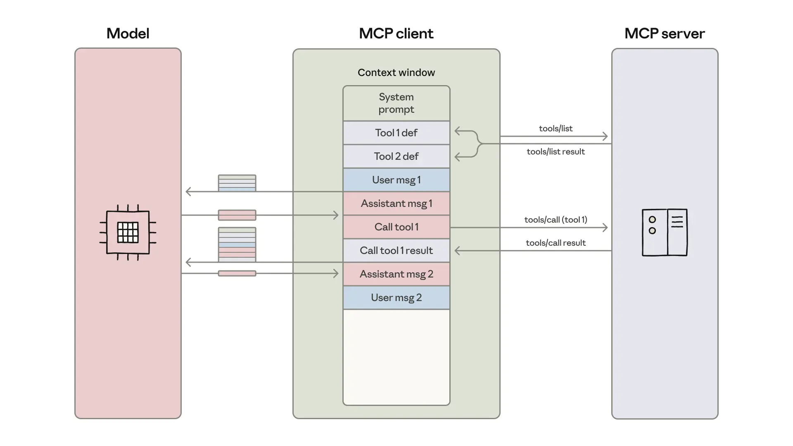

+++
title = 'Code execution with MCP: Building more efficient agents'
date = '2025-11-04T00:00:00+08:00'

description = "了解代码执行如何借助模型上下文协议（MCP）让 Agent 用更少的 Token 处理更多工具，把上下文开销最多降低 98.7%。"
categories = ["Agent"]
series = ["MCP"]
authors = ["Adam Jones", "Conor Kelly"]

toc = true
externalLink = ""
canonicalUrl = "https://www.anthropic.com/engineering/code-execution-with-mcp"
disableComments = false
+++

 直接工具调用会为每个定义和结果消耗上下文。Agent 通过编写代码来调用工具，反而能更好地扩展。下文说明它与 MCP 的协同方式。 

[模型上下文协议（MCP）](https://modelcontextprotocol.io/) 是把 AI Agent 连接到外部系统的开放标准。过去要把 Agent 接到工具和数据上，每对组合都得各写一套自定义集成，既碎片化又重复，很难扩展真正互联的系统。MCP 提供一套通用协议，开发者只需在 Agent 里实现一次，就能解锁一整套集成生态。

自 2024 年 11 月发布以来，MCP 的采用速度很快：社区已经构建了数千个 [MCP 服务器](https://github.com/modelcontextprotocol/servers)，主流编程语言都有对应的 [SDK](https://modelcontextprotocol.io/docs/sdk)，整个行业也把 MCP 当成了连接 Agent 与工具、数据的事实标准。

如今开发者构建的 Agent，常常要连上几十个 MCP 服务器、访问成百上千个工具。但随着连接的工具越来越多，一次性加载所有工具定义、让中间结果在上下文窗口里来回传递，会让 Agent 变慢、成本上升。

本文将探讨代码执行如何让 Agent 更高效地与 MCP 服务器交互，用更少的 Token 处理更多的工具。

## 工具消耗过多 Token，降低 Agent 效率

随着 MCP 的使用规模扩大，有两种常见模式会增加 Agent 的成本和延迟：

1. 工具定义挤占上下文窗口
2. 中间工具结果消耗额外的 Token

### 1. 工具定义挤占上下文窗口

大多数 MCP 客户端会一次性把所有工具定义直接加载进上下文，再以直接调用工具的语法暴露给模型。这些工具定义大概是这样的：

```plaintext
gdrive.getDocument
     Description: Retrieves a document from Google Drive
     Parameters:
                documentId (required, string): The ID of the document to retrieve
                fields (optional, string): Specific fields to return
     Returns: Document object with title, body content, metadata, permissions, etc.
```

```
salesforce.updateRecord
    Description: Updates a record in Salesforce
    Parameters:
               objectType (required, string): Type of Salesforce object (Lead, Contact,      Account, etc.)
               recordId (required, string): The ID of the record to update
               data (required, object): Fields to update with their new values
     Returns: Updated record object with confirmation
```

工具描述占据了更多上下文窗口空间，拖慢了响应速度、推高了成本。当 Agent 接入数千个工具时，它们在读到请求之前，就得先处理数十万个 Token。

### 2. 中间工具结果消耗额外的 Token

大多数 MCP 客户端允许模型直接调用 MCP 工具。比如，你可能会让 Agent：“从 Google Drive 下载我的会议记录，并附到 Salesforce 的潜在客户上。”

模型会发起类似这样的调用：

```
TOOL CALL: gdrive.getDocument(documentId: "abc123")
        → returns "Discussed Q4 goals...\n[full transcript text]"
           (loaded into model context)

TOOL CALL: salesforce.updateRecord(
			objectType: "SalesMeeting",
			recordId: "00Q5f000001abcXYZ",
  			data: { "Notes": "Discussed Q4 goals...\n[full transcript text written out]" }
		)
		(model needs to write entire transcript into context again)
```

每一步中间结果都必须经过模型。在这个例子里，完整的通话记录来回走了两遍。一场两小时的销售会议，可能意味着要多处理 5 万个 Token。更大的文档甚至可能超出上下文窗口上限，直接把工作流打断。

面对大文档或复杂的数据结构，模型在工具调用之间拷贝数据时更容易出错。


*MCP 客户端把工具定义加载进模型的上下文窗口，并编排一个消息循环：每次工具调用及其结果都会在操作之间经过模型。*

## 基于 MCP 的代码执行提升上下文效率

随着代码执行环境在 Agent 中越来越普遍，一种办法是把 MCP 服务器以代码 API 的形式暴露出来，而不是让它直接调用工具。这样 Agent 就能写代码来与 MCP 服务器交互。这一做法同时解决了上面两个问题：Agent 只加载所需的工具，并且能先在执行环境里处理数据，再把结果传回模型。

实现方式有不少。其中一种是为所有已连接的 MCP 服务器生成一棵包含全部可用工具的文件树。下面是一个 TypeScript 实现：

```
servers
├── google-drive
│   ├── getDocument.ts
│   ├── ... (other tools)
│   └── index.ts
├── salesforce
│   ├── updateRecord.ts
│   ├── ... (other tools)
│   └── index.ts
└── ... (other servers)
```

然后每个工具对应一个文件，大致像这样：

```
// ./servers/google-drive/getDocument.ts
import { callMCPTool } from "../../../client.js";

interface GetDocumentInput {
  documentId: string;
}

interface GetDocumentResponse {
  content: string;
}

/* Read a document from Google Drive */
export async function getDocument(input: GetDocumentInput): Promise<GetDocumentResponse> {
  return callMCPTool<GetDocumentResponse>('google_drive__get_document', input);
}

```

上面那个从 Google Drive 到 Salesforce 的例子，就变成了这样一段代码：

```
// Read transcript from Google Docs and add to Salesforce prospect
import * as gdrive from './servers/google-drive';
import * as salesforce from './servers/salesforce';

const transcript = (await gdrive.getDocument({ documentId: 'abc123' })).content;
await salesforce.updateRecord({
  objectType: 'SalesMeeting',
  recordId: '00Q5f000001abcXYZ',
  data: { Notes: transcript }
});

```

Agent 通过探索文件系统来发现工具：列出 `./servers/` 目录找到可用的服务器（比如 `google-drive` 和 `salesforce`），再读取它需要的具体工具文件（比如 `getDocument.ts` 和 `updateRecord.ts`），了解每个工具的接口。这样一来，Agent 只需加载当前任务所需的定义，Token 用量从 15 万降到 2000，时间和成本节省了 98.7%。

Cloudflare 也[发表过类似的结论](https://blog.cloudflare.com/code-mode/)，把基于 MCP 的代码执行称为“Code Mode”。核心洞察一致：LLM 擅长写代码，开发者应该利用这一优势，构建能与 MCP 服务器更高效交互的 Agent。

## 基于 MCP 的代码执行的优势

基于 MCP 的代码执行让 Agent 能更高效地利用上下文：按需加载工具、在数据到达模型之前先做过滤、把复杂逻辑一步执行完。这种做法在安全性和状态管理上另有好处。

### 渐进式披露

模型很擅长浏览文件系统。把工具以代码形式呈现在文件系统上，模型就能按需读取工具定义，而不必一次性全部读完。

另一种做法，是在服务器上加一个 `search_tools` 工具来查找相关定义。比如在使用前面那个假设的 Salesforce 服务器时，Agent 搜索“salesforce”，只加载当前任务需要的工具。如果在 `search_tools` 里加上一个 detail level 参数，让 Agent 自己选择所需的粒度（只返回名称、名称加描述，或是带 schema 的完整定义），也能帮 Agent 省下上下文、高效地找到工具。

### 节省上下文的工具结果

处理大型数据集时，Agent 可以在返回结果之前，先在代码里做过滤和转换。比如要取一个 1 万行的电子表格：

```
// Without code execution - all rows flow through context
TOOL CALL: gdrive.getSheet(sheetId: 'abc123')
        → returns 10,000 rows in context to filter manually

// With code execution - filter in the execution environment
const allRows = await gdrive.getSheet({ sheetId: 'abc123' });
const pendingOrders = allRows.filter(row => 
  row["Status"] === 'pending'
);
console.log(`Found ${pendingOrders.length} pending orders`);
console.log(pendingOrders.slice(0, 5)); // Only log first 5 for review
```

Agent 只看到 5 行，而不是 1 万行。同样的思路也适用于聚合、跨多个数据源的 join、或提取特定字段，全程都不会撑爆上下文窗口。

#### 更强大、更省上下文的控制流

循环、条件判断和错误处理都能用熟悉的代码模式来做，而不必串联一个个工具调用。比如，如果你需要在 Slack 里收到部署完成的通知，Agent 可以这样写：

```
let found = false;
while (!found) {
  const messages = await slack.getChannelHistory({ channel: 'C123456' });
  found = messages.some(m => m.text.includes('deployment complete'));
  if (!found) await new Promise(r => setTimeout(r, 5000));
}
console.log('Deployment notification received');
```

这比在 Agent 循环里交替使用 MCP 工具调用和休眠命令要高效得多。

此外，能把一整棵条件树写出来交给环境执行，也能省下“首 Token 时间”的延迟：与其等模型去评估一个 if 语句，不如让代码执行环境来干这件事。

### 保护隐私的操作

当 Agent 用基于 MCP 的代码执行时，中间结果默认留在执行环境里。这样 Agent 只能看到你显式打印或返回的内容，你不想分享给模型的数据可以照常流过工作流，完全不用进入模型的上下文。

对更敏感的工作负载，Agent 的 Harness 可以自动把敏感数据做令牌化。比如，假设你需要把电子表格里的客户联系方式导入 Salesforce，Agent 会这样写：

```
const sheet = await gdrive.getSheet({ sheetId: 'abc123' });
for (const row of sheet.rows) {
  await salesforce.updateRecord({
    objectType: 'Lead',
    recordId: row.salesforceId,
    data: { 
      Email: row.email,
      Phone: row.phone,
      Name: row.name
    }
  });
}
console.log(`Updated ${sheet.rows.length} leads`);
```

MCP 客户端会拦截数据，在送到模型之前先对 PII 做令牌化：

```
// What the agent would see, if it logged the sheet.rows:
[
  { salesforceId: '00Q...', email: '[EMAIL_1]', phone: '[PHONE_1]', name: '[NAME_1]' },
  { salesforceId: '00Q...', email: '[EMAIL_2]', phone: '[PHONE_2]', name: '[NAME_2]' },
  ...
]
```

之后，当这份数据在另一次 MCP 工具调用里被共享时，会通过 MCP 客户端里的查表还原。真实的邮箱、电话和姓名从 Google Sheets 流到 Salesforce，但从不经过模型。这就避免了 Agent 不小心记录或处理敏感数据。你也可以借此定义确定性的安全规则，规定数据能往哪里流、从哪里来。

### 状态持久化与 Skill

通过文件系统访问的代码执行，让 Agent 能在多次操作之间维持状态。Agent 可以把中间结果写入文件，从而恢复工作、跟踪进度：

```
const leads = await salesforce.query({ 
  query: 'SELECT Id, Email FROM Lead LIMIT 1000' 
});
const csvData = leads.map(l => `${l.Id},${l.Email}`).join('\n');
await fs.writeFile('./workspace/leads.csv', csvData);

// Later execution picks up where it left off
const saved = await fs.readFile('./workspace/leads.csv', 'utf-8');
```

Agent 还能把自己的代码保存成可复用的函数。一旦为一个任务写出了能跑的代码，它就能把这套实现存下来，供以后调用：

```
// In ./skills/save-sheet-as-csv.ts
import * as gdrive from './servers/google-drive';
export async function saveSheetAsCsv(sheetId: string) {
  const data = await gdrive.getSheet({ sheetId });
  const csv = data.map(row => row.join(',')).join('\n');
  await fs.writeFile(`./workspace/sheet-${sheetId}.csv`, csv);
  return `./workspace/sheet-${sheetId}.csv`;
}

// Later, in any agent execution:
import { saveSheetAsCsv } from './skills/save-sheet-as-csv';
const csvPath = await saveSheetAsCsv('abc123');
```

这与 [Skill](https://docs.claude.com/en/docs/agents-and-tools/agent-skills/overview) 的概念密切相关：Skill 是包含可复用指令、脚本和资源的文件夹，用来提升模型在特定任务上的表现。给这些保存下来的函数加一个 SKILL.md 文件，就能形成一个结构化的 Skill，供模型引用和使用。久而久之，你的 Agent 就能积累出一套更高层级的工具箱，逐步搭起高效工作所需的脚手架。

不过，代码执行也引入了自身的复杂性。运行 Agent 生成的代码，需要一个安全的执行环境，包括合适的[沙箱](https://www.anthropic.com/engineering/claude-code-sandboxing)、资源限制和监控。这些基础设施要求带来了额外的运维开销和安全考量，而直接调用工具则不必面对这些。代码执行带来的好处（更低的 Token 成本、更低的延迟、更好的工具组合）需要与这些实现成本放在一起权衡。

## 总结

MCP 为 Agent 连接大量工具和系统提供了一个基础协议。但当接入的服务器过多时，工具定义和结果可能消耗过多 Token，反过来降低 Agent 的效率。

尽管这里的很多问题看着新鲜（上下文管理、工具组合、状态持久化），软件工程里其实早有现成的解法。代码执行把这些成熟模式应用到 Agent 身上，让它们用熟悉的编程结构去更高效地操作 MCP 服务器。如果你采用了这套做法，欢迎把你的经验分享给 [MCP 社区](https://modelcontextprotocol.io/community/communication)。

## 原文链接

[https://www.anthropic.com/engineering/code-execution-with-mcp](https://www.anthropic.com/engineering/code-execution-with-mcp)
