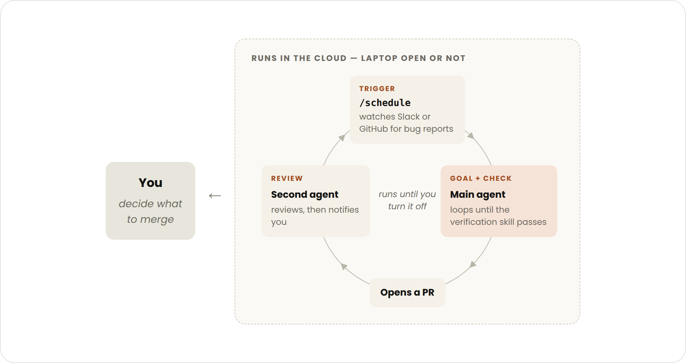

+++
title = 'Loop engineering: Getting started with loops'
date = '2026-06-30T00:00:00+08:00'

description = "使用 Anthropic 的 Claude Code 进行循环工程：设计基于轮次、目标、时间和主动式代理循环，使其运行至满足停止条件。"
categories = ["Claude Code"]
series = ["Loop Engineering"]
authors = ["Delba de Oliveira", "Michael Segner"]

toc = true
externalLink = ""
canonicalUrl = "https://claude.com/blog/getting-started-with-loops"
disableComments = false
+++

了解 Claude Code 团队如何定义代理循环，并获得从基于轮次到基于目标、基于时间和主动式循环的实用指导——以及何时使用每种循环。

## 循环入门

现在关于循环工程或"设计循环"而非提示编码代理的讨论很多。如果你花些时间在 X 上试图弄清楚循环到底是什么，你会发现多种不同的答案。

在 Claude Code 团队，我们将**循环定义为代理重复工作周期直到满足停止条件**。我们根据以下标准对几种不同类型的循环进行分类：

- 如何触发
- 如何停止
- 使用哪种 Claude Code 原语
- 每种循环最适合什么类型的任务

我们将介绍主要的循环类型、何时使用每种类型，以及如何在管理 token 使用量的同时保持代码质量。并非所有任务都需要复杂的循环；从最简单的方案开始，有选择地使用这些模式。

## 基于轮次的循环


- **触发方式**：用户提示词。
- **停止条件**：Claude 判断已完成任务或需要更多上下文。
- **最适用于**：不属于常规流程或计划的较短任务。
- **用量管理方式**：编写具体的提示词，并使用技能改进验证以减少轮次数量。

你发送的每条提示词都会启动一个手动循环，由你指挥每一轮。Claude 收集上下文、采取行动、检查工作、必要时重复，然后响应。我们称之为代理循环。

例如，让 Claude 创建一个点赞按钮。它会读取你的代码、进行编辑、运行测试，然后交出它*认为*可用的结果。然后你手动检查工作，并编写下一条提示词。

你可以通过将手动步骤编码为 SKILL.md 来改进验证步骤，这样 Claude 就能端到端地检查更多自己的工作。（关于在技能、钩子和子代理之间选择哪种自动化方式，请参阅我们的[驾驭 Claude Code](https://claude.com/blog/steering-claude-code-skills-hooks-rules-subagents-and-more)指南。）

这应该包括让 Claude 能够*查看*、*衡量*或*交互*结果的工具或连接器。检查越量化，Claude 就越容易自我验证。

例如，在你的 SKILL.md 文件中，你可以指定：

```plaintext
---
name: verify-frontend-change
description: Verify any UI change end-to-end before declaring it done.
---

# Verifying frontend changes
Never report a UI change as complete based on a successful edit alone. Verify it the way a human reviewer would:

1. Start the dev server and open the edited page in the browser.

2. Interact with the change directly. For a new control (button, input, toggle): click it, confirm the expected state change, and screenshot before/after.

3. Check the browser console: zero new errors or warnings.

4. Use the Chrome Devtools MCP, run a performance trace and audit Core Web Vitals.

If any step fails, fix the issue and rerun from step 1 — do not hand back partially verified work.

```

## 基于目标的循环（/goal）


- **触发方式**：实时的手动提示词。
- **停止条件**：目标达成或达到最大轮次。
- **最适用于**：具有可验证退出条件的任务。
- **用量管理方式**：设定具体的完成条件和明确的轮次上限，"5 次尝试后停止"。

有时，单轮不够，尤其是对于更复杂的任务。代理在能够迭代时表现更好。你可以通过用 /goal 定义"完成"的样子来延长 Claude 的迭代时间。

当你定义了成功标准，Claude 就不必自行判断什么是"足够好"而过早结束循环。每次 Claude 尝试停止时，评估模型会检查你的条件，并将其送回继续工作，直到目标达成或达到你定义的轮次。

这就是为什么确定性标准——例如通过的测试数量或达到某个分数阈值——如此有效。

例如：

```plaintext
/goal get the homepage Lighthouse score to 90 or above, stop after 5 tries.
```

## 基于时间的循环（/loop 和 /schedule）

- **触发方式**：指定的时间间隔。
- **停止条件**：你取消它，或工作完成（PR 合并、队列为空）。
- **最适用于**：重复性工作，或与外部环境/系统交互。
- **用量管理方式**：设置更长的间隔，或基于事件而非时间来响应。

一些代理工作是重复性的：任务不变，只是输入变化。例如，每天早上总结 Slack 消息。另一些工作依赖外部系统，与其交互的一种简单方式是按间隔检查并响应变化。例如，一个可能收到代码审查或 CI 失败的 PR。

对于这些情况，你可以用 `/loop` 触发 Claude 的运行，它会按间隔重新运行提示词。例如：

```plaintext
/loop 5m check my PR, address review comments, and fix failing CI
```

`/loop` 在你的电脑上运行，所以如果你关机，它就会停止。你可以通过 `/schedule` 创建例程将循环迁移到云端。

## 主动式循环



- **触发方式**：事件或计划，无需人工实时参与。
- **停止条件**：每个任务在目标达成时退出。例程本身持续运行直到你关闭它。
- **最适用于**：定义明确的重复性工作流：错误报告、问题分类、迁移、依赖升级等。
- **用量管理方式**：将例程路由到更小、更快的模型，将最有能力的模型用于判断决策。

上述原语，连同 Claude Code 的其他功能如**自动模式**和**动态工作流**（研究预览），可以组合成用于长时间运行工作的循环。

例如，要处理收到的反馈，你可以使用：

1. **`/schedule`**（研究预览）运行检查新报告的例程
2. **`/goal`** 定义完成的样子，**技能**记录如何验证
3. **动态工作流**编排代理对每个报告进行分类、修复并审查修复
4. **自动模式**让例程无需停下来请求许可即可运行

组合起来，提示词可能如下：

```plaintext
/schedule every hour: check #project-feedback for bug reports. /goal: don't stop until every report found this run is triaged, actioned, and responded to. When fixing a bug, use a workflow to explore three solutions in parallel worktrees and have a judge adversarially review them.
```

## 保持代码质量

循环输出的质量取决于其周围的系统。在设计系统时：

- **保持代码库本身整洁**：Claude 会遵循代码库中已有的模式和约定。
- **给 Claude 一种验证自身工作的方式**：用[技能](https://code.claude.com/docs/en/skills)编码你和团队认为好的标准。
- **让文档易于获取**：框架和库的文档包含最新的最佳实践。
- **使用第二个代理进行代码审查**：拥有新鲜上下文的审查者偏见更少，不受主代理推理的影响。你可以使用内置的 `/code-review` 技能或 GitHub 的[代码审查](https://code.claude.com/docs/en/code-review)。

当单个结果未达到标准时，不要止步于修复个别问题，尝试将其编码以改进系统在所有未来迭代中的表现。

## 管理 token 使用量

要管理 token 使用量，循环应有明确的边界：

- **为任务选择合适的原语和模型**：较小的任务不需要多个代理或循环。有些任务可以使用更便宜、更快的模型。
- **定义明确的成功和停止条件**：具体说明完成的样子，这样 Claude 能更快到达解决方案（但不会太快）。
- **大规模运行前先试点**：动态工作流可以生成数百个代理。先在较小的工作切片上评估用量。
- **对确定性工作使用脚本**：运行脚本比推理步骤更便宜。例如，PDF 技能可以附带一个表单填写脚本，Claude 每次直接运行，而不是重新推导代码。
- **不要比需要更频繁地运行例程**：将间隔与你所监控事物的变化频率相匹配
- **审查用量**：`/usage` 命令按技能、子代理和 MCP 分解近期用量，不带参数的 `/goal` 显示当前轮次数和 token 用量，`/workflows` 显示每个代理的 token 用量，你可以随时停止代理。

你的[模型和推理力度](https://claude.com/blog/claude-model-and-effort-level-in-claude-code)选择是影响循环成本的最大杠杆之一。

## 入门

总结如下：

| 循环类型 | 你交出的是 | 使用场景                 | 使用工具                 |
| -------- | ---------- | ------------------------ | ------------------------ |
| 基于轮次 | 检查       | 你在探索或决策           | 自定义验证技能           |
| 基于目标 | 停止条件   | 你知道完成的样子         | `/goal`                  |
| 基于时间 | 触发器     | 工作按计划在项目外部发生 | `/loop`、`/schedule`     |
| 主动式   | 提示词     | 工作是重复且定义明确的   | 以上所有，以及动态工作流 |

要开始使用循环，看看你已经在做的工作。选择一个你是瓶颈的任务，问问自己可以交出哪一部分：你能编写验证检查吗？目标足够清晰吗？工作是按计划到达的吗？

一旦有了想法，运行循环，观察结果——比如它在哪里停滞或过度延伸——不要害怕迭代改进。

更多信息，请阅读 Claude Code 文档中关于[并行运行代理](https://code.claude.com/docs/en/agents)的内容，以及[循环](https://code.claude.com/docs/en/goal)、[计划](https://code.claude.com/docs/en/routines)、[目标](https://code.claude.com/docs/en/goal)和[动态工作流](https://code.claude.com/docs/en/workflows#orchestrate-subagents-at-scale-with-dynamic-workflows)页面。

## 原文链接

[https://claude.com/blog/getting-started-with-loops](https://claude.com/blog/getting-started-with-loops)
