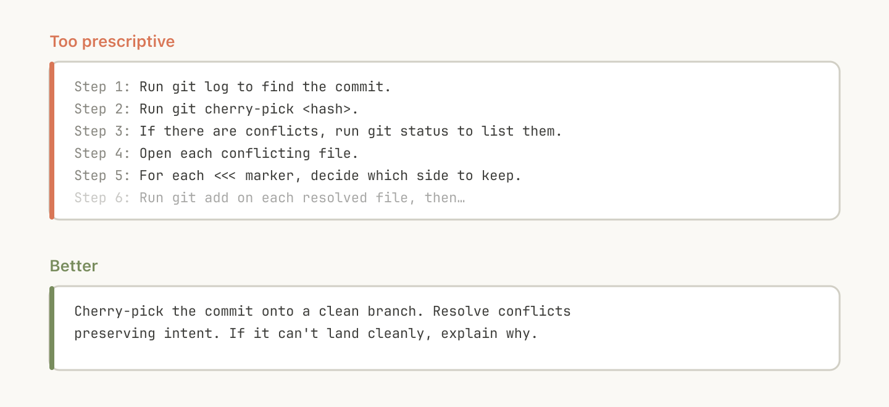
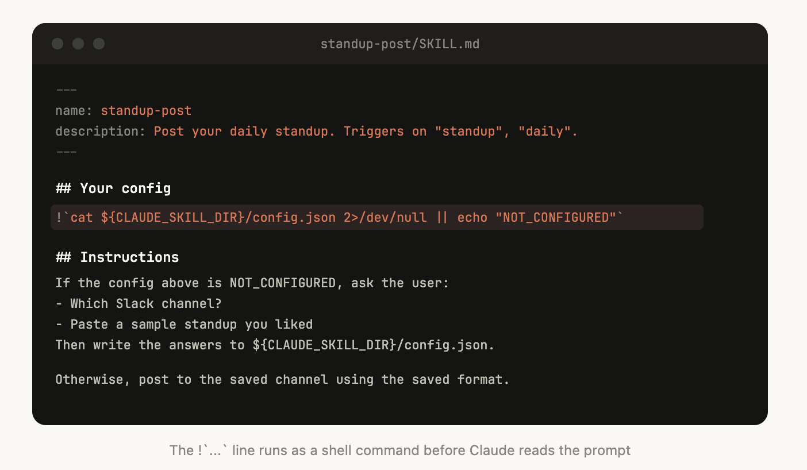

+++
title = '构建 Claude Code 的经验 · 我们如何使用 Skill'
date = '2026-06-03T00:00:00+08:00'

description = "我们在 Anthropic 内部构建和扩展数百个 Skill 过程中学到的经验。"
categories = ["Claude Code"]
series = ["Skills"]
authors = ["Thariq Shihipar"]

toc = true
externalLink = ""
canonicalUrl = "https://claude.com/blog/lessons-from-building-claude-code-how-we-use-skills"
disableComments = false
+++

 我们在 Anthropic 内部构建和扩展数百个 Skill 过程中学到的经验。 

Skill 已成为 Claude Code 中最常用的扩展点之一。它们灵活、易于创建，也易于分发。

但这种灵活性也让人难以判断什么方式最有效。什么类型的 Skill 值得创建？如何组织 Skill 的结构？什么时候该与他人分享？

我们在 Anthropic 大量使用 Claude Code 中的 Skill，目前有数百个 Skill 在活跃使用中。以下是我们关于使用 Skill 加速开发的经验总结。

## 什么是 Skill？

Skill 是包含指令、脚本和资源的文件夹，Agent 可以发现并使用它们来更准确、更高效地完成任务。本文假设读者已了解 Skill 的基础知识；如果你是新手，请先阅读我们的 [Skilljar 上的 Agent Skill 入门课程](https://anthropic.skilljar.com/introduction-to-agent-skills)。

我们经常听到的一个误解是，Skill "只是 markdown 文件"。实际上它们是文件夹，可以包含脚本、资源、数据等，Agent 可以发现、浏览和操作这些内容。

在 Claude Code 中，Skill 还有[丰富的配置选项](https://code.claude.com/docs/en/skills#frontmatter-reference)，包括注册动态 Hook。

我们发现 Claude Code 中一些最有效的 Skill 正是充分利用了这些配置选项和文件夹结构。

## Skill 的类型

在对 Anthropic 内部所有 Skill 进行分类后，我们发现它们可以归为九个类别。优秀的 Skill 能清晰地归入某一类；而那些试图做太多事情的 Skill 则横跨多个类别，反而会让 Agent 感到困惑。这不是一份权威列表，但它是识别你自己的 Skill 库中空白的有用框架。

*Claude Code 团队对内部 Skill 进行了分类，发现它们可以归入九个不同的类别。*

### 1. 库和 API 参考

这类 Skill 解释如何正确使用某个库、CLI 或 SDK。它们既可以是内部库的参考，也可以是 Claude Code 有时难以处理的常用库的参考。这些 Skill 通常包含一个参考代码片段文件夹，以及一份 Claude 在编写脚本时需要避免的陷阱清单。

示例包括：

- `billing-lib` ——你的内部计费库：边界情况、易错点等。
- `internal-platform-cli` ——你的内部 CLI 封装器的每个子命令，附带使用示例。
- `sandbox-proxy` ——为开发工作配置组织的出口网关：哪些主机可达、如何调试"连接被拒绝"错误、如何添加白名单条目。

### 2. 产品验证

这类 Skill 描述如何测试或验证代码是否正常工作。它们通常与 Playwright、tmux 或其他外部验证工具配合使用。

验证 Skill 对 Claude 内部输出质量的影响最为显著。让一位工程师花一周时间专门优化验证 Skill 是非常值得的。

可以考虑一些技巧，比如让 Claude 录制其输出的视频，这样你就能准确看到它测试了什么；或者在每个步骤中对状态强制执行程序化断言。这些通常通过在 Skill 中包含各种脚本来实现。

示例包括：

- `signup-flow-driver` ——在无头浏览器中运行注册 → 邮件验证 → 引导流程，并在每个步骤提供断言状态的 Hook
- `checkout-verifier` ——使用 Stripe 测试卡驱动结账 UI，验证发票是否真正进入正确状态
- `tmux-cli-driver` ——用于交互式 CLI 测试，当需要验证的内容需要 TTY 时

### 3. 数据获取与分析

这类 Skill 连接到你的数据和监控栈。它们可能包含用于带凭证获取数据的库、特定的仪表板 ID 等，以及关于常见工作流或数据获取方式的说明。

示例包括：

- `funnel-query` ——"我需要关联哪些事件才能看到注册 → 激活 → 付费"，以及实际包含规范 user_id 的表
- `cohort-compare` ——比较两个群组的留存率或转化率，标记统计显著的差异，链接到分群定义
- `grafana` ——数据源 UID、集群名称、问题 → 仪表板查找表
- `datadog` ——字段参考（@request_id 与 trace_id）、服务列表、指标前缀约定

### 4. 业务流程与团队自动化

这类 Skill 将重复性工作流自动化为一个命令。这些 Skill 通常包含相当简单的指令，但可能对其他 Skill 或 MCP 有更复杂的依赖。对于这些 Skill，将之前的结果保存在日志文件中可以帮助模型保持一致性，并回顾工作流的先前执行情况。

示例包括：

- `standup-post` ——聚合你的工单追踪器、GitHub 活动和之前的 Slack 消息 → 格式化的站会报告，仅显示增量
- `create-<ticket-system>-ticket` ——强制执行模式（有效枚举值、必填字段）以及创建后的工作流（通知评审人、在 Slack 中链接）
- `weekly-recap` ——已合并的 PR + 已关闭的工单 + 部署 → 格式化的周报

### 5. 代码脚手架与模板

这类 Skill 为代码库中特定功能生成框架样板代码。你可以将这些 Skill 与可组合的脚本结合使用。当你的脚手架有无法纯粹用代码覆盖的自然语言需求时，它们尤其有用。

示例包括：

- `new-<framework>-workflow` ——用你的注解脚手架一个新的服务/工作流/处理器
- `new-migration` ——你的迁移文件模板加上常见陷阱
- `create-app` ——新的内部应用，预配置你的认证、日志和部署设置

### 6. 代码质量与审查

这类 Skill 在组织内部强制执行代码质量标准并帮助审查代码。它们可以包含确定性脚本或工具以获得最大的健壮性。你可能希望将这些 Skill 作为 Hook 的一部分自动运行，或在 GitHub Action 中运行。

- `adversarial-review` ——生成一个全新的 Subagent 来批评，实施修复，迭代直到发现的问题变成吹毛求疵
- `code-style` ——强制执行代码风格，尤其是 Claude 默认不太擅长的风格
- `testing-practices` ——关于如何编写测试以及测试什么的说明

### 7. CI/CD 与部署

这类 Skill 帮助你在代码库中获取、推送和部署代码。这些 Skill 可能会引用其他 Skill 来收集数据。

示例包括：

- `babysit-pr` ——监控 PR → 重试不稳定的 CI → 解决合并冲突 → 启用自动合并
- `deploy-<service>` ——构建 → 冒烟测试 → 逐步流量切换并比较错误率 → 出现回归时自动回滚
- `cherry-pick-prod` ——隔离的 worktree → cherry-pick → 冲突解决 → 使用模板创建 PR

### 8. 运维手册

这类 Skill 接收一个症状（如 Slack 线程、告警或错误特征），通过多工具调查，并生成结构化报告。

示例包括：

- `<service>-debugging` ——将症状映射到工具和查询模式，针对你流量最高的服务
- `oncall-runner` ——获取告警 → 检查常见嫌疑 → 格式化发现
- `log-correlator` ——给定一个请求 ID，从可能涉及该请求的每个系统拉取匹配的日志

### 9. 基础设施运维

这类 Skill 执行例行维护和运维流程，其中一些涉及受益于安全防护的破坏性操作。它们使工程师更容易在关键操作中遵循最佳实践。

示例包括：

- `<resource>-orphans` ——查找孤立的 Pod/卷 → 发送到 Slack → 等待期 → 用户确认 → 级联清理
- `dependency-management` ——你组织的依赖审批工作流
- `cost-investigation` ——"为什么我们的存储/出口账单飙升"，附带特定的存储桶和查询模式

## 创建 Skill 的技巧

一旦你决定要创建什么 Skill，该如何编写它？以下是 Claude Code 团队关于创建 Skill 的一些最佳实践、技巧和窍门。

### 不要陈述显而易见的内容

Claude 已经知道如何编码，也能阅读你的代码库。一个重复 Claude 默认行为的 Skill 只会增加上下文而不增加价值。如果你要发布一个主要关于知识的 Skill，请专注于那些能推动 Claude 跳出常规思维模式的信息。

[前端设计 Skill](https://github.com/anthropics/skills/blob/main/skills/frontend-design/SKILL.md) 是一个很好的例子；它由 Anthropic 的一位工程师构建，通过与客户迭代来改善 Claude 的设计品味，避免 Inter 字体和紫色渐变等经典模式。

### 构建陷阱清单

任何 Skill 中信号最强的内容是陷阱部分。这些部分应该从 Claude 使用你的 Skill 时遇到的常见失败点中积累。理想情况下，你会随着时间推移更新你的 Skill 来捕获这些陷阱。

例如：

"`subscriptions` 表是只追加的。你需要的行是版本号最高的那行，而不是 `created_at` 最近的那行。" "这个字段在 API 网关中叫 `@request_id`，在计费服务中叫 `trace_id`。它们是同一个值。" "Staging 环境即使 Stripe webhook 没有真正处理也会返回 200。检查 `payment_events` 获取真实状态。"

### 利用文件系统和渐进式披露

*SKILL.md 文件指向 Claude 可以在特定情况下参考的其他几个文件。例如，如果某个作业处于待处理状态，它应该参考 stuck-jobs.md。*

如前所述，Skill 是一个文件夹，而不仅仅是一个 markdown 文件。你应该将整个文件系统视为上下文工程和渐进式披露的一种形式。告诉 Claude 你的 Skill 中有哪些文件，它会在适当的时候读取它们。

渐进式披露最简单的形式是指向其他 markdown 文件供 Claude 使用。例如，你可以将详细的函数签名和使用示例拆分到 `references/api.md` 中。

另一个例子：如果你的最终输出是一个 markdown 文件，你可以在 `assets/` 中包含一个模板文件供复制和使用。

你可以拥有参考文档、脚本、示例等文件夹，这些都能帮助 Claude 更有效地工作。

### 避免对 Claude 进行过度约束

Claude 通常会尽量遵循你的指令，而且由于 Skill 具有高度可复用性，你需要注意不要在指令中过于具体。给 Claude 所需的信息，但也要给它适应不同情况的灵活性。

例如：

### 考虑设置流程

*上面的 Skill 被编写为在配置中未包含 Slack 频道时提示用户。*

某些 Skill 可能需要从用户那里获取上下文进行设置。例如，如果你正在创建一个将站会报告发布到 Slack 的 Skill，你可能希望 Claude 询问发布到哪个 Slack 频道。

一个好的模式是将这些设置信息存储在 Skill 目录中的 config.json 文件里，如上面的示例所示。如果配置未设置，Agent 就可以向用户询问信息。

如果你希望 Agent 提出结构化的多选题，你可以指示 Claude 使用 AskUserQuestion 工具。

### 为模型写描述，而不是为人写

当 Claude Code 启动会话时，它会构建一个包含每个可用 Skill 及其描述的列表。Claude 扫描这个列表来决定"这个请求是否有对应的 Skill？"这意味着描述字段不是摘要，而是关于何时触发此 Skill 的说明。

*在描述中包含 Skill 的触发词（如"babysit"）是很有帮助的。*

### 帮助 Claude 记忆

*这个文本日志文件帮助 Claude 记住过去的事件，比如审查 Sarah 的认证 PR。*

某些 Skill 可以通过在内部存储数据来包含一种记忆形式。你可以将数据存储在简单的只追加文本日志文件或 JSON 文件中，也可以使用复杂的 SQLite 数据库。

例如，一个 `standup-post` Skill 可能会保留一个 standups.log，记录它写过的每篇站会报告，这意味着下次运行时，Claude 会读取自己的历史记录，并能判断自昨天以来发生了什么变化。

你可以使用环境变量 `${CLAUDE_PLUGIN_DATA}` 获取一个稳定的目录来存储数据，在[这里](https://code.claude.com/docs/en/plugins-reference#persistent-data-directory)阅读更多关于 Skill 中持久化数据的信息。

### 存储脚本并生成代码

你能给 Claude 的最强大工具之一就是代码。给 Claude 提供脚本和库，让 Claude 把它的轮次花在组合和决定下一步做什么上，而不是重建样板代码。

例如，在你的 `data-science` Skill 中，你可能有一个从事件源获取数据的函数库。为了让 Claude 进行复杂分析，你可以给它一组这样的辅助函数：

Claude 随后可以即时生成脚本来组合这些功能，对"周二发生了什么？"这样的 Prompt 进行更高级的分析。

### 使用按需 Hook

Skill 可以包含仅在 Skill 被调用时才激活、且仅在会话期间持续有效的 Hook。将此用于那些你不想一直运行、但有时极其有用的更有主见的 Hook。

例如：

- `/careful` ——通过 PreToolUse 匹配 Bash 来阻止 rm -rf、DROP TABLE、force-push、kubectl delete。你只在操作生产环境时才需要它——一直开着会让你抓狂。
- `/freeze` ——阻止任何不在特定目录中的 Edit/Write。在调试时很有用："我想添加日志，但总是不小心'修复'了不相关的代码。"

## 分发 Skill

Skill 最大的好处之一是可以与团队其他成员分享。

有两种方式可以与他人分享 Skill：

- 将 Skill 提交到你的代码仓库（放在 `./.claude/skills` 下）
- 制作一个 **Plugin**，通过 Claude Code Plugin 市场让用户上传和安装 Plugin（在[文档](https://code.claude.com/docs/en/plugin-marketplaces)中阅读更多）

对于在相对较少的代码仓库上工作的小团队来说，将 Skill 提交到代码仓库效果很好。但每个提交的 Skill 也会稍微增加模型的上下文。随着规模扩大，内部 Plugin 市场可以让你分发 Skill，让团队决定安装哪些，还可以包含设置流程。

## 管理 Skill 市场

你如何决定哪些 Skill 进入市场？人们如何提交它们？

在 Anthropic，我们没有集中团队来做决定；相反，我们尝试有机地发现最有用的 Skill。如果有人有一个想让其他人试用的 Skill，他们可以将其上传到 GitHub 上的沙盒文件夹，并在 Slack 或其他论坛中引导人们使用。

一旦某个 Skill 获得了关注（由 Skill 所有者自行判断），他们可以提交 PR 将其移入市场。

## 组合 Skill

你可能希望 Skill 之间存在依赖关系。例如，你可能有一个文件上传 Skill 负责上传文件，以及一个 CSV 生成 Skill 负责生成 CSV 并上传。这种依赖管理目前在市场或 Skill 中还没有原生支持，但你可以直接通过名称引用其他 Skill，如果它们已安装，模型就会调用它们。

## 衡量 Skill

为了了解 Skill 的使用情况，我们使用 PreToolUse Hook 来记录公司内部的 Skill 使用情况（[示例代码在这里](https://gist.github.com/ThariqS/24defad423d701746e23dc19aace4de5)）。这意味着我们可以发现哪些 Skill 很受欢迎，或者哪些 Skill 相比我们的预期触发不足。

## 开始使用

Skill 的最佳实践仍在不断演进。我们大多数优秀的 Skill 最初只是几行文字和一个陷阱提示，然后随着 Claude 遇到新的边界情况，人们不断添加内容而逐步完善。

理解 Skill 最好的方式就是开始动手、实验，看看什么对你有效。

- 查看[我们的 Skill 文档](https://code.claude.com/docs/en/skills)
- [查找可自定义的示例 Skill](https://github.com/anthropics/skills)

## 原文链接

[https://claude.com/blog/lessons-from-building-claude-code-how-we-use-skills](https://claude.com/blog/lessons-from-building-claude-code-how-we-use-skills)
