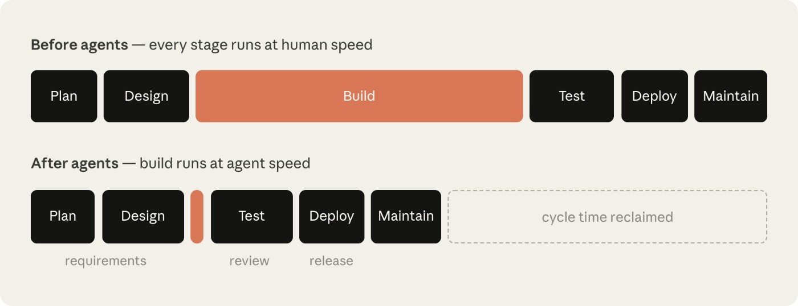

+++
title = 'AI 原生 SDLC 实战指南'
date = '2026-08-21T00:00:00+08:00'

description = "Anthropic 面向 AI 原生 SDLC 的分阶段实战指南 · 团队如何用 Claude 规划、设计、构建、测试、部署和维护软件。"
categories = ["Claude Code"]
series = []
authors = ["Louis Claxton"]

toc = true
externalLink = ""
canonicalUrl = "https://claude.com/blog/the-ai-native-sdlc-playbook"
disableComments = false
+++

 如何用 AI 逐阶段改造你的软件开发生命周期。 

## 代码不再是瓶颈

各类组织已经开始用 AI 以一年前难以想象的速度编写代码，然而围绕代码的流程却没有以同样的节奏改变。

许多工程团队仍然沿用相同的审批关卡、评审、交接和策略，拖累了使用 [Claude Code](https://claude.com/product/claude-code) 这类 agentic 编码解决方案所取得的效率提升。

软件开发生命周期（SDLC）是将软件从想法推进到生产环境的过程。大多数组织都在运行某种形式的相同六个阶段，涵盖软件的规划、设计、构建、测试、部署和维护。传统上，每个阶段都是由不同角色负责的独立环节：产品经理撰写需求，技术架构师将其转化为设计，工程师实现设计，受监管企业的 QA 团队进行验证，发布团队负责上线，运维团队监控运行情况。工作通过文档、工单和签字确认在阶段之间流转。

传统的软件开发生命周期（SDLC）流程繁重，目的是确保每一步都有人负责、都在掌控之中。然而，传统 SDLC 是为了在“编写和实现代码是最耗时、最昂贵的阶段”的时代实现效率最大化而设计的，而这一点如今已不再成立。PRD、估算仪式和产品安全评审的存在，都是为了在可能长达数周、数月甚至数个季度的开发工作中强制各方对齐。

传统 SDLC 的另一大特征是，其控制措施都假设每一步都由人来完成。那些创造最多价值的组织已经围绕 agentic AI 现在所能做的事情重建了流程，同时确保人类始终参与其中。在本指南中，我们将介绍 Applied AI 团队在 SDLC 的每个阶段内部集成 Claude 的若干最佳实践，以加速开发、让流程运转得更快——这些实践源于我们与客户的合作。

当代码不再是瓶颈、构建阶段的运行速度超过了传统 SDLC 所能容纳的范围时，有三件事会成立：

- 瓶颈会转移到构建阶段前后的环节，主要是规划、评审/测试和部署，它们仍以人类的速度运转。
- 控制措施不再符合现实，变得难以应付。当代码由人编写时，逐行人工审查是合理的；但一旦 Agent 撰写了 diff 的大部分内容，人工审查就跟不上了。
- 治理成本上升，因为例外情况仍然要通过每周或每月才开一次的会议和委员会来处理。


*构建不再是制约因素——它周围那些以人类速度运转的环节才是。以人类速度运转的阶段维持原有时长，而构建则缩短到数小时。*

以安全瓶颈为例。安全团队的规模是按人类产出来配置的，因此当 Agent 使代码产出成倍增长时，要么评审队列越积越长，要么代码在评审不足的情况下上线。受监管的组织无法接受任何一种结果，因此其安全和策略检查必须跟上 Agent 的节奏。

为了更好地实现 agentic AI 的生产力提升并保障其安全，传统 SDLC 生命周期需要经历与实现阶段同等程度的转型。

## 什么是 AI 原生 SDLC？

AI 原生 SDLC 是一个重新构想的过程，它将旧有的控制目标与新的执行方式相结合。流程不再是线性推进，而是变成一个循环，AI 被嵌入到每一个节点。AI 原生 SDLC 提倡自动化的交接和后续打法的触发，有助于解决传统 SDLC 各阶段之间手工、笨拙的交接问题。

你也会听到这种转变被称为 agentic SDLC、AI SDLC，或直接叫 agentic 软件开发——叫法不同，但描述的都是同一件事。


### AI 原生 SDLC 六个阶段的转变

下表展示了由 Claude 支撑的传统 SDLC 与 AI 原生 SDLC 之间的两个极端。大多数组织都处于这两列之间的某个位置。

| 阶段 | 传统 SDLC | AI 原生 SDLC |
| --- | --- | --- |
| 规划 | 需求由委员会收集，通过研讨会和签字确认提炼，再手工整理成文 | Claude 直接从源头综合痛点，并记录在<br>`intent.md`<br>中——它既适合人阅读，也适合机器执行 |
| 设计 | 由分析师撰写规格，再由设计师解读 | 需求与设计压缩到与 Agent 的一次工作会话中，由编码为 Skill 并纳入 git 版本管理的标准来引导 |
| 构建 | 测试和代码手写完成，文档在主要开发完成之后才撰写 | 测试和代码由 AI 生成，机构知识以纳入版本管理、机器可读的<br>`CLAUDE.md`<br>文件和 Skill 的形式维护 |
| 测试 | 在阶段边界设置 QA 关卡 | 贯穿实现过程的持续评估 |
| 部署 | 人工审查每一行代码，治理发生在评审周期中，且往往不一致 | 多层 agentic 审查，人工审查仅保留给受监管和关键代码。治理在 AI 行动时执行，以 Hook 作为审批关卡 |
| 维护 | 人工监控生产环境以发现问题 | Agent 监控实时部署。任何被突破的控制带都会被诊断，并写回循环中，作为新的<br>`intent.md` |

贯穿右栏的主线是“已提交的产物”。每个阶段结束时都会把一个产物写入版本控制（包括 `intent.md`、`spec.md`、`plan.md`、diff 及其测试、带有评审意见的 PR，以及事故记录），而下一个阶段则从读取它开始。在早期阶段，.md 文件是主要产物，因为产品负责人和 Agent 都能阅读并对同一份文件采取行动。从构建阶段开始，产物变成了代码及其记录。提交链同时也是审计轨迹：谁提出了什么、Agent 产出了什么、谁批准了它。

人类仍然要对每一个需要判断力的决策负责。在 agentic SDLC 的世界里，人类的注意力会随着必须被评审的产物而转移。

## 打法

打法是本指南的核心，被划分为六个非线性的阶段（规划、设计、构建、测试、部署、维护），共同覆盖整个生命周期。

每个打法都涵盖：

- 改变了什么；
- 如何开始；
- 具体的实施步骤；
- 治理方面的考量；以及
- 如何衡量它是否奏效。

这些步骤是模块化的，组织可以根据自身独特的需求，在不同时间优先改造不同的阶段。每个打法都会在“先决条件”下列出它的依赖项，依赖关系图对此做了进一步的说明。

一个阶段以提交某个产物作为结束，而这个提交又会启动下一个阶段。被接受的 `intent.md` 会触发需求与设计环节，被批准的 `spec.md` 会触发 plan mode，被合并的 PR 会触发流水线，生产环境中被突破的控制带则会写出下一个 `intent.md`，如此循环往复。

起初，你需要手工为每一步编写 Prompt，最终状态则是一个循环——每个被接受的产物都会触发下一道关卡。人类的注意力集中在关卡上，去评审 Agent 标记出的内容，而不是从头启动每个阶段。


*图中按阶段列出了各个打法；箭头表示采纳它们的顺序。两者并不相同。你可以从任何一个基础打法开始——没有任何箭头指向它，所以它不需要任何前置条件。对于其他打法，指向它的箭头所代表的打法，就是需要先于它采纳的打法。*

## 规划

### 以 intent.md 的形式捕获

启动软件开发流程的 `intent.md` 可以通过不同的途径进入。可能是有个人萌生了一个想法，可能是有人提交了一个工单，也可能是通过告警暴露了一起事故（参见第六阶段：维护）。

当一个人有了想法时，他会与 Claude 一起头脑风暴，产出一份 markdown 原型规格。而在传统 SDLC 中，这个人随后还必须说服产品团队的某位成员和他一起、或代他把这个想法整理成文。

由 Claude 生成的原型规格既适合人阅读、又纳入了版本控制，并且可以立即被下一个阶段使用。这份原型规格会被保存为 `intent.md`。

无论这个 intent 是源于事件触发还是 Agent，适用的步骤都一样：产品负责人会在提交之前，评审并修正由 Agent 撰写的 `intent.md`。

这项设置对平台或工程团队来说是一次性任务。需要由一位技术团队成员搭建 intent 仓库，并决定谁可以向其中写入内容，因为贡献者会来自整个组织的各个部门。

仓库建立之后，没有 git 经验的贡献者无需直接使用 git。取而代之的是，通过一个连接到版本控制系统的连接器（例如 GitHub），Claude 可以从 claude.ai 或 Cowork 代他们提交 markdown 文件。

#### 如何执行

1. 发起人用自己的话向 Claude 描述问题。发起人可以描述他们现在无法做到什么、这个想法会影响谁、更好的结果是什么样子，或哪些内容不在范围内。无需使用正式的措辞。
2. 持续头脑风暴，直到想法变得具体。Claude 会提出分析师会问的问题：范围、用户、约束，以及成功的标准是什么。
3. 请 Claude 使用组织的模板将结果写成 `intent.md`，该模板可以由技术团队成员编码为一个 Skill，并由一位负责人签字确认。这份文档可以涵盖问题、提议的成果、受影响的用户和系统、约束，以及待解决的问题。
4. 发起人修正 Claude 理解有误的地方。
5. 将 `intent.md` 提交到共享仓库。作者和时间戳会一并记录在案，产品负责人则从那里接手这个想法。

```markdown
# Intent: claims status self-service
Author: J. Ortiz (claims operations). Status: draft.

## Problem
Customers phone the contact center to ask where their claim is.
Handlers spend roughly a third of call time on status-only queries.

## Proposed outcome
Customers see claim status, next step and expected date in the portal.

## Affected users and systems
Claims handlers, portal team, claims-core API.

## Constraints
No new PII in the portal session. Existing authentication only.

## Open questions
Do third-party loss adjusters need access too?
```

#### 治理方面的考量

证据就是已提交的 `intent.md`，它列出了作者、时间戳和完整的修订历史。它被记录在 intent 仓库的 git 历史中。产品负责人负责批准，而把 intent 送入第二阶段（设计）的接受或拒绝决定，则被记录为合并或关闭评审。

## 设计

### 需求与设计

一旦得到产品负责人批准，Claude 就会拿着这份被接受的 `intent.md`，产出一份需求与设计规格。这一过程由组织针对品牌、安全、合规和 UX 制定的 [Skill](https://code.claude.com/docs/en/skills) 来引导。

产品负责人负责评审这份规格，但不会亲自撰写。这个流程的目标是产出一份工程团队可以据此制定计划的规格，并标注出需要关注的地方。

前端工作是最清晰的例子。一旦 `intent.md` 被接受，产品负责人就会根据 `intent.md` 在 [Claude Design](https://claude.com/product/design)（beta）中搭建设计原型，反复迭代，然后将其导出到 Claude Code 中进行构建。

#### 如何执行

1. 产品负责人开启一个会话，让组织的 Skill 可用，并附上 `intent.md`。
2. 产品负责人的 Prompt 会指向 `intent.md`，指明约束条件，并要求标注出关注点。起初先手工执行，然后将其固化为组织级的 slash 命令。之后，把 intent 仓库中对 `intent.md` 的接受作为触发器，用一个在合并时触发的非交互式作业、在加载组织 Skill 的情况下运行这一环节，并把 `spec.md` 作为拉取请求提交（第五阶段（部署）中的 CI/CD 打法负责这部分管道搭建）。从那时起，产品负责人的第一次参与就是评审。
3. 同一位产品负责人会对照最初的想法来评审这份规格：这份规格是否解决了所陈述的问题？`intent.md` 中待解决的问题是被解答了，还是被延续了下来？
4. 先处理那些被标注出来的关注点，因为它们是分析师原本会升级上报的问题。产品负责人要在工程团队看到规格之前，与相应的策略负责人逐一解决这些问题。
5. 将 `spec.md` 与 `intent.md` 一并提交。这对文件记录了提出的是什么、决定了的是什么。
6. 产品负责人决定这份规格和 intent 是否推进到构建阶段，对于组织认定为较高风险的事项，则会咨询技术负责人。这个决定始终由一位人类团队成员做出，而接受这份规格正是启动第三阶段（构建）中 plan mode 打法的信号。

#### 实际样子（Prompt）

```markdown
Read the attached intent.md and produce a requirements and design spec for integrating it into our existing codebase. Apply the skills available to you so the plan conforms to our brand guidelines, security policies and UX standards. Document the spec fully as spec.md, ready to hand to the engineering team. Describe clearly any areas of concern, especially where you cannot satisfy contradicting policies.
```

#### 治理方面的考量

现行策略不再是在几周后的评审中才被发现，而是在撰写规格时就被读取和应用。组织的 Skill 会作为约束施加在规格之上。这份规格、生成它的 Prompt，以及当时生效的 Skill 版本，都会被记录在版本控制中。产品负责人签署确认这份规格，并将标注出的关注点转交给指定的策略负责人。

## 构建

### Claude Code plan mode 作为默认起点

工程师在 [plan mode](https://code.claude.com/docs/en/permission-modes) 下启动 Claude Code 会话，把第二阶段（设计）中已获批准的 `spec.md` 交给 Claude，并让它对自己进行提问，反复迭代计划，直到工程师满意为止。

#### 如何执行

1. 工程师在 plan mode 下与 Claude 开启会话。
2. 工程师把 `intent.md` 和 `spec.md` 交给 Claude，要求它给出一个实现计划，指明哪些文件会发生变化、工作的顺序，以及用于验证的测试。
3. 通过追问来审视这份计划：这次变更可能破坏什么？哪一步风险最大？Claude 还有哪些没有选择的方案？
4. 反复迭代，直到一个从未看过这段对话的工程师，仅凭这份计划就能实现这次变更。
5. 把已获批准的计划作为 `plan.md` 提交。这份计划会进入审计轨迹，而 PR 评审打法（第五阶段：部署）会据此核验最终的 diff。
6. 接受这份计划，让 Claude 去实现。有了扎实的计划，实现往往一遍就能完成。
7. 当实现偏离计划时，在同一次提交中更新 `plan.md`。可以考虑使用一个 Hook 来强制两者保持同步。

#### 实际样子（plan.md）

```markdown
# Plan: claims status self-service (from intent.md 2026-06-02)

## Files that change
portal/src/claims/StatusPanel.tsx (new), claims-api/routes/status.py,
claims-api/tests/test_status.py

## Order of work
1. Add the status endpoint behind existing auth.
2. Panel against the endpoint.
3. Wire into the portal nav.

## Risks
The claims-core API rate-limits at 50 rps; the panel must cache.
## Proof
test_status.py covers the four claim states; screenshot matches the
approved mock.
```

#### 治理方面的考量

设计评审发生在任何代码生成之前，此时改变方向还只是编辑一份文档而已。plan mode 本身就强制了这一点，因为在工程师接受计划之前，Claude 无法编辑文件。计划及其修订会连同接受者一起被记录下来。常规变更由工程师批准，而组织认定为较高风险的事项则交由技术负责人或架构师处理。

### 在 auto mode 下运行 Claude Code

Claude Code 也可以在 auto mode 下运行：工程师批准计划，一旦满意并完成迭代，Claude 就会在不经逐次编辑确认的情况下应用每一处变更。随着后续打法中的护栏逐渐成熟（一份调校好的 `CLAUDE.md`、编码了策略的 Skill、阻止不安全操作的 Hook，以及一个 Claude 可以运行的测试套件），auto-accept 会成为常规工作的默认方式：一份紧凑的 `spec.md`、较小的改动影响范围，以及已有测试覆盖的代码。

这种转变意味着，用户不再盯着 Agent 进行编辑、审查每一步操作，而是在更长的自主会话之后评审产物。配合 worktree 使用，auto-accept 模式还能进一步实现个人和团队层面的并行化，对于自主运行 SDLC、实现第六阶段（维护）所描述的闭环至关重要。

### CLAUDE.md

[`CLAUDE.md`](https://code.claude.com/docs/en/memory) 为 Claude 提供了新成员所需要的上下文，涵盖约定、命令、架构，以及团队最常犯的错误。那些过去存放在人们头脑中和 wiki 里的知识，变成了一份 Agent 在每次会话开始时都会读取的文件，由整个团队维护，每当犯下错误时都会进行迭代。

#### 如何执行

1. 在仓库中运行 `/init`。Claude 会根据它找到的内容生成一份初始的 `CLAUDE.md`。
2. 把生成的文件精简到新成员第一天真正需要的内容。保留构建、测试和 lint 命令、重要的约定，以及 Claude 反复出错的地方。
3. 把 `CLAUDE.md` 提交到仓库根目录的 git 中，让整个团队共享同一个版本，变更也像代码一样接受评审。
4. 这里有一条行之有效的经验法则：当 Claude 在同一处错误上犯两次时，就把纠正写进 `CLAUDE.md`。
5. 把它控制在一页以内，因为 Claude 会在会话开始时通读全部内容，任何过时的内容都只会白白占用上下文。

#### 实际样子（CLAUDE.md）

```markdown
# Payments service

## Commands
- Build: make build
- Test: make test (unit), make itest (integration, needs docker)
- Lint: make lint (runs in CI; fix before pushing)

## Conventions
- Java 21, Spring Boot 3. No new Lombok.
- Money is always BigDecimal, never double.
- Every endpoint needs an integration test in src/itest.

## Architecture
- api/ holds REST controllers, core/ holds domain logic,
  adapters/ talks to external systems.
- Kafka events are defined in schemas/; never edit generated classes.

## Things Claude gets wrong
- Do not bump dependency versions; the platform team owns them.
- The legacy v1/ package is frozen; changes go in v2/.
```

#### 治理方面的考量

`CLAUDE.md` 纳入版本控制，因此 Agent 所遵循的指令是可评审、可审计的。团队约定通过这份文件来落实，对它的变更记录在 git 历史中，代码负责人在 PR 评审中批准这些变更。

### 把 Skill 作为机构知识

Skill 是组织让机构知识变得可操作的方式。这些指令明确、纳入版本控制、被广泛地应用，并在策略变化时集中更新。经验法则是：为那些必须一致应用的机构知识编写 Skill；而对于本就该放在 `CLAUDE.md` 或 Prompt 里的内容，则不要编写 Skill。

#### 如何执行

1. 挑选一条目前执行得不一致的知识。它可以是安全标准、API 设计约定，或品牌规则。
2. 把它写成一个 Skill，也就是一个包含 `SKILL.md` 的文件夹，其 frontmatter 说明何时触发，正文说明该做什么。由工程师根据策略负责人的事实来源来编写，并借助 Claude 的帮助。
3. 把 Skill 放在仓库的 `.claude/skills/<name>/` 目录下，让它随代码一起分发，或通过 [plugin](https://code.claude.com/docs/en/plugin-marketplaces) 在整个组织范围内分发。
4. 测试 Skill 是否能正确触发。用不同的方式让 Claude 执行相关任务，确认每次都能加载该 Skill。
5. 当策略变化时，更新 Skill，并由策略负责人签署确认这次变更。
6. 工程师会在下一次会话中自动使用新版本。

#### 实际样子（.claude/skills/secure-api-review/SKILL.md）

```markdown
---
name: secure-api-review
description: Apply the API security standard. Use whenever creating or
  modifying an external-facing endpoint, reviewing API code, or
  generating an OpenAPI spec.
---
# Secure API review

When you create or change an API endpoint:
1. Authentication: every endpoint requires the gateway JWT;
   no anonymous routes outside /health.
2. Input validation: validate request bodies against the OpenAPI
   schema and reject unknown fields.
3. Audit: every state-changing endpoint emits an audit event with
   actor, action, entity and timestamp.
4. Data classification: fields tagged pii in the schema must never
   appear in logs or error messages.

Run scripts/check-endpoints.sh and include its output in your summary.
```

#### 治理方面的考量

Skill 是一种控制手段，尽管是建议性质的。它让 Claude 在编写代码时更有可能应用该策略，但没有任何东西能强制某个会话遵守它。对于必须始终成立的策略，需要在 Skill 背后有确定性的机制，例如一个阻止该操作的 Hook，或在 PR 阶段重新核验该策略的评审环节。Skill 让违规变得罕见，而 Hook 让违规几乎不可能发生。Skill 的调用会记录在会话追踪中，策略负责人也会像评审代码一样评审 Skill 的变更。

### 用 Hook 作为构建期护栏

Skill 是一种建议性质的控制，而 [hook](https://code.claude.com/docs/en/hooks) 则是它背后的确定性机制。在实现过程中，Claude 的大多数操作都是文件编辑和 shell 命令，因此构建阶段是 Hook 最常被触发的地方。

构建阶段的 Hook 可以：

- 阻止对受保护路径的编辑，例如生成的类或冻结的包；
- 在文件编辑后运行格式化工具和 linter，避免偏差不断累积；
- 防止凭据进入 diff。

对于任何策略必须无例外地成立的 Skill，都要用 Hook 来兜底。Hook 会在每个与之匹配的操作上运行，因此构建阶段的 Hook 应当快速，并只针对发生变化的文件。完整测试套件这类较重的检查，则应放在提交或 PR 环节。

需要人工批准的 Hook 应放在第五阶段（部署）的关卡中，因为在构建期间弹出批准提示，会把一个人重新拉回到所有并行运行会话的关键路径上。

### 并行会话与 Subagent

一位工程师可以同时推进多条工作流。

并行会话是另一个完整的 Claude Code 实例，在它自己的 [git worktree](https://code.claude.com/docs/en/worktrees) 中处理一项独立任务。每个独立会话对其他会话一无所知，它们唯一的共同点就是那位驾驭它们的工程师。

一个 [Subagent](https://code.claude.com/docs/en/sub-agents) 在单个会话内部运行，作为一个受限的助手，拥有自己的上下文窗口和工具限制，适合那些在多个任务中反复出现的工作，例如验证应用是否按预期运行。

并行会话提高了工程师可以同时推进的任务数量，而 Subagent 让每个会话专注于自己的任务。工程师的工作就是驾驭和评审所有这些会话。

#### 如何执行

1. 工程师利用 plan mode 打法（第三阶段：构建）中的计划，把工作拆分成涉及不同文件的任务，看清哪些工作是相互独立的。涉及相同文件的任务放在单个会话中，按顺序执行。
2. 每个并行任务都有自己的 worktree，例如在一个终端中运行 `claude --worktree feature-auth`，在另一个终端中运行 `claude --worktree fix-rate-limit`。worktree 是在各自分支上的独立检出，可以避免会话在文件上发生冲突。
3. 两到三个会话是一个合理的起点。实际上限是一个人能够妥善评审多少条工作流，所以只有当评审跟得上时，才增加会话。
4. 把重复性的工作改造成 Subagent，它们定义在 `.claude/agents/` 目录下的 markdown 文件中，每个都包含名称、使用时机说明，以及可以接触的工具。例子包括：在主要 Agent 完成后剥离不必要复杂度的代码简化器、运行应用并检查行为的验证器、探索代码库并回报结果而不会淹没主上下文的研究器。把这些定义提交到 git 中，让整个团队共享。

#### 实际样子（.claude/agents/verifier.md）

```markdown
---
name: verifier
description: Runs the app and checks the change works before the session
  reports done
tools: Bash, Read
---
Start the app with make run. Exercise the changed behavior and the two
nearest neighboring flows. Report what you ran, what you saw, and any
behavior that does not match plan.md. Do not fix anything; report only.
```

#### 治理方面的考量

会话越多，产出就越多，因此控制必须来自仓库中的配置。那里的 Hook 和权限设置会应用到所有会话，而每个会话做了什么都会被记录下来，并归因于运行它的工程师。

## 测试

### 给 Claude 一个反馈回路

始终给 Claude 一种验证自身工作的方式，无论是测试、构建，还是截图 diff。会话会检查自己的工作，并在工程师看到之前修正自己的错误。

不要把反馈回路与验证器 Subagent（第三阶段：构建）混为一谈。反馈回路贯穿整个任务，随着工作推进反复运行。而验证器 Subagent 则是在会话认为工作完成之后，用一个全新的上下文窗口来执行最终检查的一种方式。这样一来，结论就不会被产出代码的那些假设所影响。

#### 如何执行

1. 如果今天检查工作需要一连串命令和一定的环境知识，就把它封装成单个目标，例如 “make test” 或 “npm test”，在失败时以非零状态退出。
2. 在 `CLAUDE.md` 的 Commands 部分，为每条命令列出一个健康输出的示例。
3. 明确一个目标并让它可量化，这样 Claude 就无需询问你就能检查工作，例如：“test_status.py 中的所有测试都通过”、“截图与所附的原型一致”，或“该接口带着新字段返回 200”。
4. 对于 bug 修复，先写一个失败的测试。请 Claude 把这个 bug 复现为一个测试，运行它，并确认它因为预期的原因而失败。提交这个测试。然后才请 Claude 在不修改测试的前提下让它通过，并由最后一步中的测试文件 Hook 来强制执行这一限制。一个在修复之前就已存在、且 Agent 无法改写的测试，就是这个 bug 已被消除的证明。
5. 对于 UI 工作，用视觉检查来闭环。给 Claude 一个浏览器或截图工具，给它原型，让它迭代。实现、截图、对比、调整。两到三轮是正常的，结果应当每一轮都有所改进。
6. 把验证纳入“完成”的定义。相关指令写在 `CLAUDE.md` 中。在报告任务完成之前先运行测试，并展示输出。
7. 最后，这个回路本身也需要保护，因为正在修复代码的 Agent 绝不能有能力削弱对该代码的检查。一个在修复任务期间阻止编辑测试文件的 Hook 就能做到这一点。另一种办法是在评审中检查 diff，并拒绝任何改动测试的变更。

#### 实际样子（CLAUDE.md 验证块）

```markdown
## Verifying your work

- Build: make build (must finish with "Build succeeded")
- Test: make test (all green; never skip or delete a failing test)
- Lint: make lint (zero warnings)

Run all three before reporting any task complete, and paste the output.
If a test fails, fix the code, not the test.
```

### 在 CI 中进行持续评估

评估（eval）是 AI 原生世界中阶段关卡式 QA 的对应物。在实践中，它指的是每当 Agent 的配置发生变化时就会运行的一套测试。当换入一个新模型或改写一个 Prompt 时，评估套件会说明这个 Agent 是否仍以同样的标准完成工作。

评估应当被看作一个持续演进的套件。随着模型的改进，那些曾经能区分好坏的用例会渐渐失去区分度，必须加入由持续监控所产生的新用例。

根据具体用例的不同，一些团队可能更愿意按固定节奏离线运行这些评估，而不是在每次变更时都运行。下面的步骤针对的是持续评估。

#### 如何执行

1. 平台工程师从近期工作中收集 20 到 50 个真实任务，并附上预期或已接受的成果。
2. 把每个任务写成一个评估，也就是 Prompt 加上定义“可接受”的检查（测试通过、lint 干净、行为不变、策略得到遵守）。
3. 这个套件在 CI 中按计划非交互式地运行，并在 `CLAUDE.md`、Skill 或 Hook 发生任何变更时运行，因为正是这些配置在引导 Agent，值得像代码一样接受回归测试。
4. 根据结果对配置变更进行把关。一个导致通过率下降的 Skill 变更，在合并之前必须先经过评审。
5. 每一起生产事故都要有一个评估，由负责该事故的团队编写，并作为回归测试留在套件中。

#### 实际样子（.github/workflows/agent-evals.yml）

```yaml
name: Agent evals
on:
  pull_request:
    paths: ['CLAUDE.md', '.claude/**']
  schedule:
    - cron: '0 2 * * *'
jobs:
  evals:
    runs-on: ubuntu-latest
    steps:
      - uses: actions/checkout@v4
      - run: npm install -g @anthropic-ai/claude-code
      - name: Run eval suite
        env:
          ANTHROPIC_API_KEY: ${{ secrets.ANTHROPIC_API_KEY }}
        run: |
          for eval in evals/*.json; do
            claude -p "$(jq -r '.prompt' $eval)" \
              --allowedTools "Read,Edit,Bash(make test)" \
              --output-format json > result.json
            ./evals/check.sh "$eval" result.json
          done
```

#### 治理方面的考量

评估为 QA 提供了一个能跟上 Agent 产出的关卡。通过率阈值作为合并检查来执行，运行结果会被记录以便跨时间对比，而负责配置变更的团队则负责批准这些变更。

## 部署

### PR 评审回路中的 AI

Claude 既给出评审，也接受评审。它依据组织的策略评审进入的 PR，并处理自己 PR 上的评审意见。这让工程师能够在 PR 评审中专注于行为本身，归结起来就是判断意图和风险。

#### 如何执行

1. 托管的 Code Review 服务是最快的起步方式。管理员启用它并选择仓库。当你需要控制流水线、或希望 API 调用走你自己的云协议时，可以在自己的 CI 中用 claude-code-action 运行评审（CI/CD 打法负责这部分管道搭建）。
2. 技术负责人把评审策略写成仓库根目录下的 `REVIEW.md`，并按照组织关心的环节来划分：bug 与逻辑错误；安全与漏洞；针对规格（需求打法中的 `spec.md`）、实现计划（plan mode 打法中的 `plan.md`）和设计原则的合规性。`REVIEW.md` 还定义了什么是重要问题（Important）、什么是小问题（Nit），以及什么可以跳过。
3. 技术负责人设定人工介入的阈值。发现的问题本身既不会批准也不会阻止一个 PR，分支保护仍然要求代码负责人的批准。希望根据发现的问题来把关合并的平台工程师，可以读取检查运行所发布的、机器可读的严重程度统计。
4. 当评审人或作者在评审意见上标记 `@claude` 时，Claude 会处理这条意见并推送修复。PR 线程会同时记录请求和变更。这个修复回路通过 claude-code-action 运行。在托管服务中，评论 `@claude review` 则会请求一次全新的评审。对于 Claude 自己打开的 PR，还可以更进一步，让 Claude 一直照料这个 PR 直到合并。团队通常用一个自定义 slash 命令把这个回路包起来：它会扫描 PR 上未解决的评审意见和失败的检查，逐一处理并推送修复，直到 PR 变绿、只剩代码负责人的批准。
5. 评审发现的问题会反馈回 `CLAUDE.md`。当评审第二次标记出同一个错误时，纠正就会作为该评审的一部分写入 `CLAUDE.md`，而且因为评审会读取 `CLAUDE.md`，这个错误从下一个 PR 开始就会被拦截。评审还会标记出那些让 `CLAUDE.md` 变得过时的变更。
6. 技术负责人每个月对设置做一次调优：为发现的问题打分，让评审器不断改进，并在 `REVIEW.md` 中限制 Nit 的数量。生成路径以及 CI 已经在强制约束的内容都会被排除在外。

#### 实际样子（REVIEW.md）

```markdown
# Review instructions

## Passes
Run three passes and tag each finding with its pass:
- Bugs: logic errors, broken edge cases, subtle regressions
- Security: injection risks, authentication gaps, PII in logs
- Compliance: the change matches spec.md, plan.md and our design principles

## What Important means here
Reserve Important for findings that would break behavior, leak data
or breach a policy. Style and naming are nits.

## Cap the nits
Report at most five nits per review; summarize the rest as a count.

## Do not report
Generated files under src/gen/ and anything CI already enforces.
```

#### 治理方面的考量

职责分离得以保留，因为编写代码的 Agent 无法批准它自己的代码。`REVIEW.md` 中的评审策略会应用到所有 PR，发现的问题、修复、评分和批准都会记录在 PR 历史中，因此 PR 本身就是审计记录。批准由人通过分支保护来完成，并以发现的问题为依据。

关于这些控制措施如何在生产规模下协同工作，参见 [在 Anthropic 保障 AI 原生 SDLC 的安全](https://claude.com/blog/how-anthropic-secures-its-ai-native-software-development-lifecycle)。

### 用 Hook 作为审批关卡

构建阶段把 Hook 用作护栏，在没有人工参与的情况下允许或阻止操作（第三阶段：构建）。Hook 还可以进行询问，暂停操作直到某个指定的人批准——这正是发布把关所需要的。

这个打法放在第五阶段（部署），因为发布关卡是最典型的场景，但 Hook 并不只用于部署：它们会在 Claude 行动的任何地方运行。例如，Hook 可以在第三阶段（构建）期间，在没有变更工单的情况下阻止对迁移和基础设施的编辑，也可以在第四阶段（测试）的修复任务中阻止 Agent 编辑测试文件。

#### 如何执行

1. 工程领导层与变更管理和合规团队一起，列出必须保留的人工审批关卡，例如变更管理签字确认、发布授权，以及对受保护路径的编辑。
2. 平台工程师把每个关卡都实现为一个 Hook，也就是一个在 Claude 行动之前运行的脚本，可以允许、询问或阻止。
3. 团队级 Hook 放在 git 中的 `.claude/settings.json` 里，而不可协商的 Hook 则放在由平台或 IT 管理员拥有的托管设置中，单个工程师无法关闭它们。
4. 阻止操作时应当给出解释，这样当 Hook 拦下某个操作时，原因和获得批准的途径就会出现在 Claude 的输出中。

#### 实际样子（.claude/settings.json）

```json
{
    "hooks": {
      "PreToolUse": [
        {
          "matcher": "Bash",
          "hooks": [
            { "type": "command",
              "command": "${CLAUDE_PROJECT_DIR}/.claude/hooks/production-gate.sh" }
          ]
        }
      ]
    }
}
```

#### 以及关卡本身（.claude/hooks/production-gate.sh）

```bash
#!/bin/bash
# Production deploys require a named release authorization
cmd=$(jq -r '.tool_input.command' < /dev/stdin)
if [[ "$cmd" == *"deploy"* && "$cmd" == *"production"* ]]; then
   if [ -z "$RELEASE_APPROVAL" ]; then
     echo "Production deploys need a release authorization." >&2
     exit 2 # exit 2 blocks the action; the message goes to Claude
   fi
fi
exit 0
```

#### 治理方面的考量

Hook 就是审批关卡。关卡条件每次、对每个人都强制执行。允许和阻止的决定都会连同时间戳一起记录。关卡还定义了什么才算批准，无论是一张已批准的变更工单，还是发布负责人的签字确认。

### CI/CD 集成与部署

在 CI/CD 流水线内部非交互式地运行 Claude Code，对执行进行沙箱隔离，让长时间运行的 Agent 能够安全运行，通过 MCP 集成暴露部署能力，并在 Agent 真正需要之前就演练好回滚路径。

#### 如何执行

1. 平台工程师先从只读的判断步骤开始。在流水线作业中用 `claude -p` 来排查失败的构建、总结不稳定的测试，或起草变更日志。
2. 在现有关卡之后增加写步骤，用于修复 lint、更新生成的文档，或通过 `@claude` 提及来处理评审意见这类作业。Agent 写出的任何东西都会通过分支保护以 PR 的形式到达，而 Agent 没有任何途径直接推送到 main。
3. 执行过程是沙箱隔离的。Agent 作业在网络策略下运行在容器中，使用短生命周期的受限 Token，并且默认不持有任何生产凭据。
4. 通过 MCP 暴露部署能力。部署、状态和回滚都变成工具，并按环境划分作用域，这样 Agent 的部署权限就是一个允许清单，而不是一个带着凭据的 shell 脚本。
5. 按环境划分自主权限的层级。在开发环境中，Agent 可以自由部署。在生产环境中，Agent 准备发布，由发布负责人授权，并由一个 Hook 强制执行生产关卡。Staging 环境则介于两者之间。
6. 回滚应当是流水线中演练得最多的路径，是 Agent 可以运行的单条命令，并且要在 Staging 中定期演练。闭环打法（第六阶段：维护）会在控制带被突破时调用这个回滚，因此它必须事先得到验证。

#### 实际样子（流水线步骤）

```yaml
- name: Triage failed build
  if: failure()
  run: >
    claude -p "Read the build log at out/build.log. Identify the most
    likely cause, say whether the failure looks flaky or real, and write a
    three-line summary for the PR thread." >> triage.md
```

#### 治理方面的考量

治理原则是：Agent 可以一直行动到生产关卡，但不能越过它。下面的控制措施就是为了执行这一原则。

- 分支保护会把 Agent 写出的任何内容都变成一个 PR，没有任何直接通往 main 的路径。
- 生产部署 Hook 会阻止发布，直到指定的发布负责人授权。每次非交互式运行都以 Agent 自己的身份执行，因此流水线日志能把 Agent 做了什么与触发它的工程师做了什么区分开来。
- 按环境划分的权限层级，决定了 Agent 在通往关卡的路上能做多少事。

## 维护

### 维护与闭环

到目前为止，我们讨论的都是如何把 Claude 引入 SDLC 流程的每个阶段，而每个阶段都需要人来启动最初的步骤。然而，这一阶段把重点转向了让 Claude 自主运行，从而实现闭环。

例如，一个持续运行的监控 Agent 可以在 bug 工单被提出之后，创建一份 `intent.md`，然后依次流经需求、计划、构建、测试和评审阶段。第六阶段（维护）是无头运行的，阶段之间有一个独立的置信关卡——一个确定性检查或一个对抗式审查 Agent——来决定上一阶段的产出是继续推进，还是升级给人工处理。

### 闭环

一个确定性脚本监控着生产环境，在控制带被突破时调用 Claude。对突破进行监控，是循环自主运行模式的一个很有用的例子，而本阶段末尾的 [Claude Tag](https://claude.com/product/tag)（公开 beta）部分，则涵盖通过不同渠道到达的工作。

#### 如何执行

1. 服务负责人或平台工程师挑选一个具有稳定滚动基线的指标，例如 CI 测试失败率、部署后的 5xx 错误率，或 PR 周期时长。
2. 他们编写检测脚本，通常是在滚动窗口上计算均值和标准差，并配合规则（Western Electric 或类似规则），让控制带既能捕捉缓慢漂移，也能捕捉突发尖峰。脚本纳入版本控制并经过单元测试，检测过程完全保持确定性，不涉及任何模型。
3. 响应层级定义在纳入版本控制的配置中（见下文的 `bands.yaml`）。在 1σ 时，脚本只记录日志；在 2σ 时，它只读地调用 Claude 进行诊断；在 3σ 时，Claude 可以采取行动，但只能通过向评审关卡提交一个 PR，或触发一份预先批准的运维手册。
4. 触发层可以是 GitHub 或 GitLab 中的计划工作流、来自现有监控栈的 webhook，或网络内部的 Cron Job。Claude 以无状态方式运行，既可以作为 CI runner 上的非交互式步骤，也可以作为沙箱化容器中的 Agent SDK 服务，而 CI/CD 打法负责部署和模型访问的方案。由于运行是无状态、非交互式的，一个循环可以在没有任何人启动的情况下自行开始和结束。
5. Agent 把它的诊断以第一阶段（规划）的格式写成 `intent.md`，涵盖异常及其证据、提议的成果、受影响的系统以及任何待解决的问题。从那里开始，这个发现就像其他任何内容一样进入流水线。
6. 服务负责人或值班工程师对这个队列进行分诊，把面向产品的发现转给产品负责人。可以选择立即修复、排期处理，或予以忽略。忽略操作会调校控制带，有助于减少噪音。
7. 当修复上线后，为这起事故添加一个评估（持续评估打法），以确保今后能防范此类问题。

#### 实际样子（例如，监控 CI 测试失败率的 bands.yaml）

```yaml
metric: ci_test_failure_rate
baseline: rolling_30d
rules: western_electric
tiers:
  1sigma: { action: log }
  2sigma: { action: diagnose,
            tools: "Read,Grep,Bash(gh run view *)" }
  3sigma: { action: propose,
            routes: [pull_request, runbook:rollback-deploy] }
```

#### 治理方面的考量

层级边界由纳入版本控制的配置强制执行，权限和托管设置则禁止生产环境的访问。调用、发现和分诊决定都会连同时间戳一起记录。服务负责人负责分诊和批准发现的问题，由此产生的变更走正常的 PR 评审关卡，而 Agent 可能触发的运维手册都是事先批准过的。

#### 示例

- 当 CI 测试失败率突破 3σ 时，Agent 会隔离那个不稳定的测试，或打开一个回滚 PR，由评审关卡来做决定。
- 当部署后的 5xx 错误率在窗口期内有一处部署时突破 3σ，Agent 会触发现有的回滚流水线。
- 当 PR 周期时长触发漂移规则时，Agent 会为工程领导层撰写一份报告，这表明 Harness 对流程指标和生产指标同样有效。

### 周期性的代码库扫描

安全扫描是针对某个特定模型下代码库的一份时点快照，而它的两部分都会过时：代码每周都在变化，而每一代模型都会发现上一代遗漏的漏洞。AI 原生的做法是按计划运行扫描，调用路径中不包含人工，并把扫描发现的问题像代码库的任何其他变更一样送过同样的关卡。

[Claude Security](https://claude.com/product/claude-security) 是计划扫描的托管形式。连接一个 GitHub 仓库，扫描就会在 Anthropic 的基础设施上以 Claude Mythos 5 运行，每个发现的问题在报告之前都会经过验证，并附带一个置信度评级。建议的补丁会在网页版 Claude Code 中进行评审和应用。组织无需自行访问模型，就能获得这些发现。

#### 如何执行

1. 安全负责人连接各个仓库，并按仓库、服务或团队把它们组织成项目，让发现的问题从一开始就有明确的归属。
2. 对最关键的仓库运行一次完整的首次扫描，包括那些之前已被其他工具或早期模型扫描过的仓库。把首次扫描当作基线。首次扫描很可能会在之前被认为干净的代码中发现一些问题。
3. 为每个项目设置计划。对于活跃开发的服务，每周一次是合理的默认值；对于大型或混合型的仓库，可以把扫描范围限定在某个目录或分支。
4. 拿着置信度评级对发现的问题进行分诊。忽略时要给出理由，这样忽略操作会被记录，同一个问题就不会在下一次运行时作为新问题再次出现。
5. 对于有明确边界的发现，在网页版 Claude Code 中打开建议的补丁，评审它，并像其他任何变更一样把它送过 PR 评审关卡。提出修复的 Agent 没有任何途径去批准它。
6. 对于超出单个补丁范围的任何问题，例如架构上的薄弱点或跨服务重复出现的模式，就把它以第一阶段的格式写成 `intent.md`，并从规划阶段开始处理。
7. 当修复发布到生产环境后，把针对这一类漏洞的评估加入持续评估打法的套件中，这样从那时起，引导 Agent 的配置就会针对这一类漏洞接受测试。
8. 把发现的问题导出为 CSV 或 Markdown，或使用 webhook，让组织现有的跟踪和审计系统继续作为记录系统，也就是审计人员已经习惯去查看的地方。

#### 治理方面的考量

扫描在组织的管理控制下运行，也就是说，连接哪些仓库、谁持有扫描席位、以及支出上限，都由中心统一设置。每个发现都有验证结果和置信度评级，每次忽略都有理由，因此扫描历史就是一份审计记录，记录了发现了什么、修复了什么，以及有意识地接受了什么。

修复是通过 PR 评审关卡和分支保护到达生产环境的，而不是来自扫描本身。Claude Security 是对现有静态分析和依赖扫描的增强。确定性检查继续留在 CI 中，而模型驱动的扫描则覆盖那些这些检查本就不擅于发现的、依赖上下文的漏洞。

### 用 Claude Tag 让 Claude 值班

事故也可以通过其他途径到达，例如 Slack 或 Teams 这类工作沟通应用。事故可能看起来就像深夜 10 点事故频道里一条请求紧急修复的 Slack 消息，而现在它可以被立即处理。Claude Tag（公开 beta，目前在 Slack 中可用）让 Claude 以自己的身份成为这些频道的成员，这样每一起新事故都能立刻有一位第一响应者，而响应本身也成为循环的一部分，并为未来的事故留下记忆。

对话和机构知识都留在频道里，频道中的任何人都可以引导和推动响应。任何团队成员都能实时验证假设、探索新方案并进行调查，而频道历史则增强了可审计性。Claude 通过访问 MCP，验证指标已回到基线，并在线程中予以确认，然后把复盘写入一份纳入版本控制的经验文件，供未来的调查阅读。

事故并不是 Claude Tag 接手的唯一工作。通过 MCP 在工单上被 @ 标记、或在频道里被提问后，Claude 会以同样的方式对工作分诊。一个规模小、边界清晰的修复会以 PR 的形式通过评审关卡，而任何更大的工作则会被写成 `intent.md`，进入第一阶段（规划），此时循环开始自我运转。参见：[Claude Tag 如何在 Anthropic 承担 CI/CD 值班](https://claude.com/blog/ai-ci-cd-on-call)。


*频道就是审计轨迹：请求、诊断、人工授权和修复，全都留在事故被处理的地方。*

## 结语

模型和 Harness 已经变得更加先进，让组织不仅能够改造自己编写代码的方式，还能改造整个软件开发生命周期。

这场转型让人类的判断始终处于流程的中心，同时兼顾大型企业组织的治理和监管要求。

本指南汇总了我们 Applied AI 团队每天为客户执行的许多真实最佳实践，希望你能把它当作一份实用、可落地的资源。

## 原文链接

[https://claude.com/blog/the-ai-native-sdlc-playbook](https://claude.com/blog/the-ai-native-sdlc-playbook)
